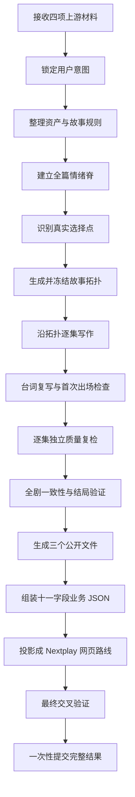

# 分集规划师从开始到结束发生了什么

可以。把这个 Skill 想象成一座“互动影游分集生产工厂”：

它前面接收已经确认的游戏企划和资产，中间完成故事结构、分支、剧本和质量检查，最后把结果转换成网页能够稳定展示的故事路线。

它不是收到材料后马上写剧本，而是依次经过：



下面从头到尾展开讲。

## 一、什么时候才能启动它

`episode-generator_biz` 不是故事构思 Skill，也不是资产设计或视频生成 Skill。

启动前必须已经有四类正式材料：

```text
游戏企划
├─ 故事主线
├─ 世界规则
├─ 体量
├─ 推荐节点数
├─ 选择方向
└─ 结局要求

角色描述
场景描述
道具描述
```

其中角色描述必须存在；场景和道具如果上游明确没有，可以是空列表。

大纲里的“剧情节点总数建议”只是软区间。例如大纲建议 8～10 个节点，Skill 会尽量从这个区间里选择一个确定数字，但不会为了凑到 10 个节点破坏剧情。

如果大纲没有提供建议节点数，Skill 也不会停下来追问，而是根据：

- 游戏体量
- 情绪变化
- 真实分支数量
- 选择结果
- 结局数量

自行推导一个合适的剧情节点数。

只有用户明确说“必须正好 12 集”，12 才会成为硬约束。

---

## 二、第一层：先锁定用户到底要什么

Skill 真正开始创作前，第一件事不是分析剧情，而是建立“用户意图锁”。

它会把用户本轮明确提出的要求分成几类：

- 必须保留的主线
- 必须存在的人物关系
- 必须发生的关键事件
- 世界规则
- 指定选择
- 结局数量和结局方向
- 固定集数
- 明确禁止出现的内容
- 哪些内容不允许修改

例如用户说：

> 主角最终必须放走坦克，但可以决定是否公开真相。

这就属于硬约束。Skill 不能因为自己觉得“摧毁坦克更合理”而删除或者改写它。

优先级是：

```text
用户最新且明确的要求
    ↓
上游已经确认的企划与资产
    ↓
Skill默认规则和创作偏好
    ↓
模型自己的判断
```

如果用户前后两次要求真的无法同时成立，例如：

- 前面说主角必须活到结局；
- 后面又说唯一正式结局必须是主角牺牲；

Skill 不能擅自挑一个，而是暂停并 AskUser，让用户决定。

如果新要求只是明确修订旧要求，例如：

> 原来三个结局，现在改成两个。

则直接以最新要求为准，并在内部记录旧要求已被替代。

这些合同和判断都属于内部资料，不能展示给玩家，也不能作为数据库业务字段输出。

---

## 三、第二层：整理故事运行基础

用户意图锁定后，Skill 会把四项上游材料压缩成一个适合长期运行的故事基础。

### 1. 冻结世界事实

包括：

- 故事核心
- 主题与题材
- 世界规则
- 核心冲突
- 游戏体量
- 必须发生的事件
- 结局数量与方向

“冻结”的意思是：后面的写作不能随便改变这些事实。

### 2. 冻结人物状态

每个角色至少要知道：

- 现在想要什么
- 已经知道什么
- 不知道什么
- 能做到什么
- 不能做到什么
- 与其他角色是什么关系
- 平时怎么说话

这样可以避免人物为了推动剧情突然获得不该知道的信息，或者突然拥有此前没有的能力。

### 3. 建立正式资产目录

Skill 会生成私有的 `asset-catalog.json`，记录：

```text
正式角色
正式场景
正式道具
角色允许使用的简称
允许不出场的候选角色
```

这一步会检查：

- 名称是否为空
- 是否使用合法字符串
- 同类资产是否重名
- 角色简称是否冲突
- 剧本是否使用了不存在的资产
- 正文名称与关联资产字段是否一致

所以不能上游叫“霍峥”，剧本里突然把他写成“霍将军”，却没有登记这个简称。

---

## 四、第三层：先建立情绪脊，再画路线

这是整个 Skill 的结构核心。

它不允许模型先随便画一棵分支树，再往节点里填故事；也不允许先写完一条线性剧情，再强行插入几个选项。

正确顺序是：

```text
情绪主线
    ↓
真实情绪拐点
    ↓
价值或行动分歧
    ↓
选择节点
    ↓
完整故事拓扑
```

### 1. 情绪脊是什么

Skill 会用三个内部维度描述主角在每一集中的状态：

- V：情绪是偏正面还是偏负面
- A：情绪是平静还是激烈
- D：人物是掌控局面还是被局面控制

例如：

```text
第1集：异常出现，主角被动受压
第2集：获得第一条线索，掌控感上升
第3集：误以为找到答案
第4集：答案被推翻，重新失控
第5集：必须承担代价
第6集：通过最终决定夺回掌控
```

这些数值只用于内部判断，不会输出给玩家。

### 2. 为什么要先做情绪脊

因为一个选择只有同时满足两件事，才值得成为真正的互动：

1. 玩家面对了不同的价值、风险、关系或行动方向；
2. 不同选择会改变后续的情绪轨迹和事实结果。

如果两个选项只是：

- 从左门进去
- 从右门进去

但最后马上发生完全相同的事情，它就不是真选择。

### 3. 如何构建分支

Skill 使用“编织带”结构，而不是让分支无限裂开：

```text
主线
  ↓
选择
  ├─ 结果A
  │    ↓
  └─ 结果B
       ↓
   带着差异汇合
       ↓
    后续选择
       ↓
    不同结局
```

重要规则包括：

- 每个选项必须先产生自己的即时结果；
- 两个选项不能直接连到同一个节点；
- 汇合后不能清空之前的选择差异；
- 失败路线可以提前结束；
- 正式结局通常在后段逐步打开；
- 不允许孤立节点、断链、循环或者无法抵达结局的路线；
- 非结局节点不能成为死路；
- 所有真实路线都必须从唯一入口出发。

### 4. 情绪脊与选择绑定

每个带选择的剧情节点，都必须是一个真实的情绪拐点。

但选择节点自己没有单独的情绪坐标，因为它不演剧情，只负责询问玩家：

> 现在选择做什么？

情绪变化属于选择发生前的剧情节点，以及选择之后的结果节点。

---

## 五、第四层：冻结拓扑

当情绪脊和分支路线全部通过检查后，Skill 会冻结一份唯一拓扑。

这里冻结的内容包括：

- 每个剧情节点
- 节点之间的边
- 哪些节点有选择
- 选择问题
- 选项文字
- 每个选项的目标
- 汇合位置
- 结局节点
- 正式结局与失败结局
- 前置节点和后续节点
- 会被后续读取的状态差异

冻结以后，写剧本只能为现有节点填充内容，不能一边写一边偷偷增加节点、删除分支或者把选项改到别的结局。

这解决了过去常见的问题：

> 前面的拓扑明明有三条路线，写到后面模型觉得麻烦，就自己合并成一条。

现在这种变化会直接导致验证失败。

---

## 六、第五层：沿着拓扑一集一集写

拓扑冻结后，才进入正式写作。

Skill 不会把整个项目、所有路线、全部角色档案和全部剧本一次塞进上下文。每次只给当前一集需要的信息：

```text
当前节点要求
直接前置节点的真实结果
仍然有效的状态差异
当前相关角色
可能首次出场的角色
当前场景与道具
世界规则
直接后续入口
```

这就是上下文吞吐控制。

它的目的有两个：

- 避免一次给模型太多信息，导致剧情密度失控；
- 避免不同路线和不同角色的信息互相污染。

### 每一集怎么写

每集按“相邻因果拍”推进：

1. 人物遭遇了什么；
2. 他根据已知事实怎么理解；
3. 他现在想得到或阻止什么；
4. 他具体采取什么行动；
5. 环境、人物或规则怎样阻挡；
6. 他怎样调整办法；
7. 行动造成什么可见后果；
8. 什么新压力把故事推向下一集。

它不要求每集机械写八段，但不允许跳过关键过程。

比如不能写：

> 霍峥决定调查坦克，随后发现了时空裂隙真相。

中间必须演出：

- 他如何接近坦克；
- 谁阻止他；
- 他看见了什么；
- 他为什么改变判断；
- 他怎样验证；
- 这次验证付出了什么代价。

### 信息密度控制

一集主要解决一个核心问题。

不能在同一集里同时完成：

- 新人物登场
- 身份揭晓
- 世界观解释
- 关系反转
- 重大追逐
- 最终真相
- 新选择

重大事件必须完整演出。装不下时，就拆到相邻节点，而不是用一段旁白全部讲完。

---

## 七、第六层：角色首次出场必须让观众认识他

新角色第一次出现时，必须在正文里自然提供三类信息：

1. 他是谁；
2. 他与眼前人物、组织或任务是什么关系；
3. 他为什么现在出现在这里。

例如不能直接写：

> 梁叔走进档案室：你终于来了。

如果观众此前完全不知道梁叔是谁，这就会失败。

应该在行动或对话中自然交代：

> 档案管理员梁叔推开门，把值夜登记簿夹在腋下。他负责保管旧楼全部消防记录，今晚是林见秋约他来核对七年前的维修档案。

它还不是简单检查“角色最早出现在哪个编号”。

因为互动故事有多条路线。同一个角色可能：

- 在A路线第3集首次出现；
- 在B路线一直没出现；
- 到汇合后的第6集才第一次被B路线玩家看见。

因此首次出场检查是“按每一条真实观看路径”计算的。

每个首次出场节点都要有三条能在正文里逐字找到的证据。

---

## 八、第七层：台词必须单独复写一次

初稿写完不代表台词合格。

Skill 会把本轮生成或修改的每一集台词单独提取出来，再执行一次“轻量台词复写”，然后放回原位置。

重点检查：

- 问话有没有得到回答、拒绝或明确回避；
- 台词是否回应上一句话；
- 人物是否突然说出自己不该知道的信息；
- 一句话是否承担了太多解释；
- 是否像人在现场说话；
- 不同身份的人说话方式是否有区别；
- 对峙是否形成来回交锋；
- 是否把作者总结写成了人物台词；
- 是否直接把游戏选项念了出来。

如果剧情中出现：

- 短信
- 信件
- 报告
- 日记
- 屏幕文字
- 病历
- 名单
- 邮件

而这些文字会推动剧情，Skill 还会专门检查它们是否被转化成玩家能自然理解的戏剧信息，避免角色站在原地朗读大段文件。

---

## 九、第八层：每一集都要经过独立复检

每集写完和台词复写完成后，会生成一个独立复检包。

它不是让刚刚写完正文的同一段思路顺手说“检查通过”，而是重新读取：

- 当前正文
- 质量规范
- 用户要求摘要
- 用户意图合同
- 正文指纹
- Reference 指纹

然后逐项检查：

- 设定是否过载
- 因果是否跳跃
- 人物身份是否清楚
- 新角色是否有铺垫
- 台词是否自然
- 问答是否承接
- 普通话描述是否清楚
- 场面有没有完整演出
- 信息有没有一次给太多
- 是否符合用户明确要求

发现问题，只修改对应分集。

修复以后必须重新生成复检包，不能复用旧检查结果。

复检通过后会为当前正文生成私有回执。回执与正文内容、质量规则、用户要求和合同绑定。只要相关内容发生变化，旧回执就失效。

但是全局 Skill 版本号本身不再使回执失效。也就是说，只升级 Skill 而正文与相关规则没变，不会无意义地要求全部重检。

---

## 十、第九层：全剧级验证

所有分集完成后，还要再做一次全局检查。

### 剧情结构检查

确认：

- 唯一入口存在；
- 所有节点可达；
- 没有循环；
- 没有孤立节点；
- 非结局节点有后续；
- 所有路线都能到达结局；
- 选择先产生差异，再允许汇合；
- 汇合后保留来路差异。

### 结局检查

根据当前企划实际传入：

- 预期结局总数
- 正式结局数
- 失败结局数

这些数量不是固定模板。

例如企划要求：

```text
2个正式结局
1个失败结局
```

验证器就必须找到正好：

```text
总结局数：3
正式结局：2
失败结局：1
```

### 资产与角色检查

确认：

- 正式角色是否都实际进入剧本；
- 可选角色是否确实由上游允许省略；
- 正文出现的角色是否写进关联角色；
- 关联角色中的人是否真的出现在正文；
- 场景和道具名称是否合法；
- 首次出场证据是否覆盖所有真实路径。

### 用户要求履约检查

最终还会独立检查一次：

> 用户最初要求的每一项内容，最终到底落在哪里？

每个硬要求都必须提供能在拓扑或正文中找到的证据。不能只写一句“已满足”。

---

## 十一、第十层：生成三个公开文件

所有创作和质量验证通过后，Skill 从同一份冻结结果生成三个公开文件：

```text
episode-flowchart.svg
episode-structure.md
episode-script.md
```

分别承担：

- `episode-flowchart.svg`：完整路线、分支、汇合和结局；
- `episode-structure.md`：分集编号、标题、类型、梗概和公开跳转；
- `episode-script.md`：全部分集的完整十一字段剧本。

公开目录只能有这三项。

下列内容全部留在私有工作区：

- 用户意图合同
- 情绪脊
- 内部拓扑推导
- 资产索引
- 首次出场证据
- 复检包
- 回执
- 哈希
- 缓存
- 修复记录
- 内部错误摘要

所以玩家不会看到类似：

> 情绪脊校验通过
>
> 正在重整拓扑
>
> 回执已封存
>
> 缓存已更新

默认整个生成过程保持静默。如果平台强制要求长任务状态，只允许显示：

> 正在生成中

---

## 十二、第十一层：组装十一字段业务结果

公开文件通过后，Skill 才会组装工程需要的业务 JSON。

顶层只有：

```text
分集列表
```

每一集严格包含十一个一级字段：

```text
分集对象
├─ 分集编号
├─ 分集标题
├─ 分集数
├─ 分集剧本
│  ├─ 完整剧本
│  └─ 单集梗概
├─ 剧本分析
│  ├─ 本集冲突
│  ├─ 前置节点编号列表
│  └─ 后续节点编号列表
├─ 关联角色
├─ 关联场景
├─ 关联道具
├─ 是否结局
├─ 选择节点
└─ 互动节点
```

字段不能增加、缺失、改名或乱序。

### “分集数”是什么

业务中的`分集数`只统计有完整剧情的互动节点。

例如：

```text
10个剧情节点
2个选择节点
```

那么业务字段：

```text
分集数 = 10
```

而不是12。

并且这10个分集对象中，每一项都会重复填写同一个`分集数=10`。

---

## 十三、最容易混淆的地方：两种节点到底是什么

这里需要区分“业务数据层”和“网页路线层”。

### 1. 业务数据层

业务的`分集列表`中，每一项都是有完整剧情的互动节点，也就是一集。

所以每条记录固定为：

```text
互动节点.是否为互动节点 = true
选择节点.是否为选择节点 = false
```

如果这集播完后需要玩家选择，则在这一集的`选择节点`字段里封装一次选择信息：

```text
是否有选择问题 = true
选择节点编号 = choice-001
选择问题 = 玩家现在怎么办？
选项列表 = [...]
```

这里不另外生成一个“选择分集”，也不把选择计入`分集数`。

### 2. 网页路线层

网页要把选择显示成一张独立卡片，因此路线投影器会把业务中封装的选择展开：

```text
剧情卡
   ↓
选择卡
   ├─ 选项A → 目标剧情卡
   └─ 选项B → 目标剧情卡
```

因此：

```text
业务剧情节点数 E = 10
唯一选择数 C = 2
网页可见节点总数 = E + C = 12
```

这就是我们最近解决的核心问题。

---

## 十四、0.14 怎样兼容当前网页

理想情况下，选择卡应该使用原生：

```text
node_type = choice
```

但当前网页运行时不能稳定加载这种节点，实际测试会导致项目详情异常。

因此0.14采用兼容载体：

```text
剧情卡
├─ node_type = video
├─ logical_node_type = episode
└─ interaction = false

选择卡
├─ node_type = video
├─ logical_node_type = choice
├─ choice_ref = choice-xxx
└─ interaction = true
```

也就是说，两者在网页底层暂时都用`video`载体，但逻辑身份完全分开。

这不是把选择重新塞回剧情节点，而是：

- 剧情卡保持纯剧情；
- 选择卡保持独立；
- 用元数据声明选择身份；
- 用互动字段承载问题和选项；
- 用不同类型的边连接。

选择卡还必须带有非空的剧情承接文字和`after_plot_beat`，避免成为只有选项、没有剧情语境的空卡。

---

## 十五、第十二层：确定性投影网页路线

业务 JSON 通过后，必须由固定投影器生成路线，模型不能手写路线节点。

投影过程是：

```text
十一字段业务 JSON
        ↓
创建每个剧情卡
        ↓
识别哪些剧情后有选择
        ↓
创建唯一选择卡
        ↓
创建剧情→选择的 default 边
        ↓
创建选择→目标剧情的 choice 边
        ↓
统一分配网页 episode_ref
        ↓
生成 route.json
```

最重要的不变量是：

```text
第一项节点
=
entry_node_ref
=
唯一入度为0的节点
=
有非空完整剧本的episode-001
```

这保证网页不会再从选择卡开始。

此外还要求：

- 剧情卡数量等于业务`分集列表`长度；
- 选择卡数量等于唯一有效选择数；
- 每个选择只生成一次；
- 剧情卡不能自己开启互动；
- 剧情卡先连选择卡；
- 选择卡再连目标剧情；
- 目标使用已经冻结的编号；
- 前端不得从分支目标重新编号；
- 结局没有出边；
- 非结局不能成为死路；
- 所有节点必须从入口可达。

网页设置中的：

```text
settings.episode_count
```

记录的是网页实际卡片数量，因此是：

```text
剧情卡数量 + 选择卡数量
```

它和业务十一字段里的`分集数`不是同一个计数口径。

---

## 十六、最终提交为什么必须“一次性”

Skill 不允许边生成边把节点写进网页。

因为如果在验证完成前逐个提交，就可能出现：

- 第一集还没写入，选择节点已经显示；
- 一份选择生成了多张卡；
- 新旧路线混在一起；
- 节点更新了，但边还是旧的；
- 设置里的数量和实际节点数不一致；
- 半条路线已经被玩家看到。

因此最后有一道提交屏障：

```text
原版创作门禁通过
+
三个公开文件通过
+
十一字段业务JSON通过
+
路线投影通过
+
投影与业务交叉验证通过
=
允许提交
```

任意一项失败：

```text
不提交部分结果
不追加旧路线
不保留半成品节点
```

重做时必须整组替换节点和边。

---

## 十七、修改已有剧本时怎么处理

Skill 还区分三类修改。

### 修改上游事实

例如改变角色身份、世界规则或主要结局。

处理方式：

```text
重新冻结故事基础
→重新检查情绪脊
→重新生成受影响拓扑
→受影响剧本重新写
```

### 修改节点或分支

例如新增选择、改选项目标、删除结局。

处理方式：

```text
解冻拓扑
→重新验证图结构
→使受影响正文和回执失效
→重写相关分集
```

### 只改某集台词

这种修改不能顺手改变剧情。

它会使用旧版本作为基线，并明确：

```text
允许修改：episode-005
修改范围：dialogue
```

验证器会确保：

- 其他分集一字没变；
- 当前集非台词内容没变；
- 拓扑没变；
- 选择没变；
- 结局没变；
- 状态没变。

这样就不会出现“用户只让润色两句对白，模型顺便重写了整条路线”。

---

## 十八、一句话总结整个架构

这个 Skill 可以概括成四层：

```text
创作层
├─ 用户意图
├─ 世界与资产
├─ 情绪脊
├─ 分支拓扑
└─ 逐集剧本

质量层
├─ 因果检查
├─ 台词复写
├─ 首次出场
├─ 资产一致性
├─ 结局数量
├─ 用户要求履约
└─ 修改范围审计

业务层
├─ 三个公开文件
├─ 十一字段分集列表
├─ 互动节点
└─ 选择信息

网页适配层
├─ 剧情卡
├─ 独立选择卡
├─ 入口
├─ 连线
├─ 连续编号
└─ 页面实际节点总数
```

最核心的设计思想是：

> 先确保故事成立，再确保每集像人写的，最后才把正确的故事转换成网页节点；工程适配不能反过来改变创作流程。
