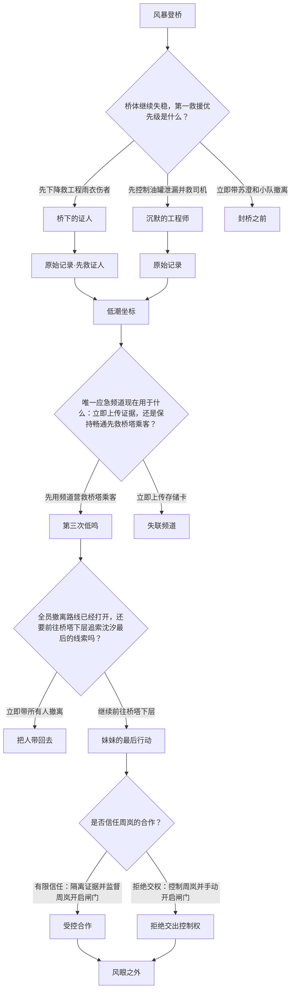

# bridge delivery

{"episode_count": 14, "choice_node_count": 4, "ending_count": 4, "total_node_count": 18}；路径 9；图形 PASS

## episode-001 风暴登桥

台风“鹭旋”逼近临港市，跨海大桥将在二十五分钟后强制封闭。海上救援队长沈砚带队登桥，发现一辆转运救护车悬在护栏外，记者苏澄卡在后座，桥面下方还有一名穿工程雨衣的伤者。中控广播反复催促所有人撤离。沈砚固定主绳救出苏澄时，她把一支旧录音笔塞进他手里。录音里是沈砚失踪八年的妹妹沈汐，她说“如果桥在大风里发出三次低鸣，就去找检修层的原始验收记录”。此刻桥身第一次低鸣，苏澄称今晚的车祸不是意外，有人正在清除旧案证据。前方油罐车开始泄漏，桥下伤者也在呼救，沈砚必须确定第一救援优先级。

## episode-002 桥体继续失稳，第一救援优先级是什么？

桥体继续失稳，第一救援优先级是什么？

## episode-003 沉默的工程师

沈砚先控制油罐车泄漏并拖出司机，避免整段桥面起火，但桥下的梁启明在等待中被摆动钢索砸伤右手。苏澄也因滞留在风口出现低温症状。梁启明获救后承认曾协助沈汐取证，却因沈砚先救司机而保持戒备，只肯交出检修层机械钥匙和最基本的操作顺序，无法亲手完成精细操作。锁控记录仍显示周岚权限。三人赶到检修入口时，沈砚必须在时间更紧、梁启明不完全信任自己的情况下继续取证。

## episode-004 桥下的证人

沈砚先沿主绳下降，及时救起梁启明。梁启明因被优先救援而愿意完整交代八年前协助沈汐取证的经过，并主动保管机械钥匙；但油罐车泄漏扩大，司机吸入浓烟后才被拖出，救援队还损失了一组被油污浸透的主绳。梁启明指出远程锁控来自周岚权限，并承诺亲自完成检修层的隔离操作。众人赶到检修入口时，证人更信任沈砚、技术操作更有保障，却少了一组关键绳索，司机状况也更危急。

## episode-005 封桥之前

沈砚判断油罐泄漏、桥下伤者和突发低鸣已经超出小队能力，下令带苏澄立即撤向安全段，并把工程雨衣伤者位置交给后续重装救援组。封桥闸门在众人身后落下，台风随后摧毁部分桥面。苏澄与大多数救援队员生还，但梁启明和司机未能及时获救，检修层的记录也随进水损坏。录音笔只留下沈汐模糊的警告，八年前的失踪案没有足够证据重启。沈砚保住了眼前能够带走的人，却只能看着大桥在黑暗里吞没最后线索。

## episode-006 原始记录

检修门后积水上涨。梁启明的右手被钢索砸伤，无法完成精细操作；他又因沈砚先救司机而只肯逐步口述。沈砚依照指令用机械钥匙切到本地维护模式，第一次接错旁路，警报迫使他重新断电，额外耗掉两分钟。苏澄在等待中低温症状加重，只能裹着应急毯继续记录。沈砚最终拔掉控制器光纤并锁定只读桥接器，使周岚启动的远程清除任务失去写入权限。梁启明确认存储卡数据完整，却明确表示受伤的右手此后不能再操作绞盘或闸门。三人带着只读存储卡进入维护间内侧，前方传来桥塔乘客的求救。

## episode-014 原始记录·先救证人

检修门后积水上涨。梁启明因被优先救下而主动操作机械钥匙，很快切到本地维护模式，拔掉控制器光纤并锁定只读桥接器，使周岚启动的远程清除任务失去写入权限。与此同时，油污浸透的主绳彻底报废；沈砚只能拆下一段桥体固定安全索，先把吸入浓烟的司机移到维护间内侧供氧。这个补救占用了唯一的备用安全索，后续撤离只能依靠桥上的固定步道和闸门。梁启明确认存储卡数据完整，并把报废主绳留在门外，无法再带走。三人带着只读存储卡进入维护间内侧，前方传来桥塔乘客的求救。

## episode-018 低潮坐标

维护间内侧的备用灯恢复，苏澄检查只读存储卡，确认原始验收数据和时间戳均未损坏。她翻看录音笔后盖，发现“02:40／B-17”的刻码。梁启明说明，02:40是沈汐八年前留下录音的时间，不是今晚的潮汐预报；B-17才是桥塔下层系留浮标的编号。众人用B-17查到旧检修图上的系留槽位置，再读取今晚仍在线的桥墩潮位计和实时潮汐表，确认本夜03:18至03:27水位降到检修口以下，只有这个窗口能够进入。中控屏同时显示桥塔避险平台仍有三名乘客，主桥锚点开始位移。存储卡清除已经解除，但唯一应急频道一次只能承担一项高带宽任务：立即上传证据，或保持频道畅通先引导乘客撤离。沈砚把设备停在发送确认页，尚未执行任何一项。

## episode-007 唯一应急频道现在用于什么：立即上传证据，还是保持畅通先救桥塔乘客？

唯一应急频道现在用于什么：立即上传证据，还是保持畅通先救桥塔乘客？

## episode-008 第三次低鸣

沈砚暂缓上传，让应急频道保持畅通。他根据中控风速和步道传感器数据，逐段指挥三名乘客穿过桥塔固定检修步道；救援队在安全段接住最后一人。苏澄留在维护间看守已锁定只读的存储卡，梁启明则用语音核对每个锚点编号。周岚试图切断频道，被本地维护模式拒绝，随后亲自赶到维护间，要求以总指挥身份封存证据。苏澄从他雨衣上的绝缘胶确认他此前来过控制器旁，周岚被迫承认今晚启动过清除任务。第三次低鸣响起，主桥进入不可逆失稳；闸门前的固定步道仍能通往安全段，桥墩潮位计则显示水位正在接近实时潮汐表标出的03:18进入窗口。沈砚必须决定立即撤离，还是按旧检修图标定的位置进入桥塔下层寻找B-17。

## episode-009 失联频道

沈砚同意苏澄立即占用应急频道上传存储卡。传输刚过一半，周岚切断维护间电源，数据包损坏；同时桥塔乘客失去调度指引，在断裂步道前被困。沈砚尝试恢复频道，却错过锚点位移的最后撤离窗口。桥体剧烈倾斜，维护间防水门卡死，梁启明为手动开门受伤。救援队只能隔着变形钢梁听见沈砚的呼叫逐渐消失。事后只恢复出无法完成法律验证的碎片，周岚把事故归因于台风和违规上传，旧案再次被掩埋。

## episode-010 全员撤离路线已经打开，还要前往桥塔下层追索沈汐最后的线索吗？

全员撤离路线已经打开，还要前往桥塔下层追索沈汐最后的线索吗？

## episode-011 把人带回去

沈砚压下追查妹妹最后足迹的冲动，命令所有人沿已打开的安全路线撤离。周岚试图夺取存储卡，被梁启明和救援队控制；苏澄将存储卡封入防水证物袋。众人在主桥局部坍塌前抵达安全段，三名乘客、伤员和救援队全部生还。存储卡使八年前的桥梁验收造假案得以重启，周岚也因毁证未遂被调查，但沈汐坠海前经历了什么仍缺少最后证据。沈砚接受救援首先是把活着的人带回去，把录音笔留作私人纪念。

## episode-012 妹妹的最后行动

沈砚依照旧检修图锁定B-17系留槽，并等待桥墩潮位计进入今晚实时潮汐表标出的03:18至03:27窗口；水位降到检修口以下后，他进入桥塔下层找到B-17。它不是漂流浮标，而是八年前用钢缆固定的桥塔应急定位器；外壳虽被海水侵蚀，内部黑匣子舱仍由双层密封圈、干燥剂和环氧灌封保护。沈汐当年把录音写入断电仍可保存的工业闪存后关闭电源，因此八年间没有持续耗电，梁启明用维护接口只读导出，校验码仍与录音笔里的编号一致。录音证明沈汐发现隐患后折返警告工人，坠海源于周岚延迟封桥和承包方追赶；周岚事后伪造救援时间，却并未亲手伤害她。此时存储卡仍处于只读保护，证据完整，但维护间进水，定向传输只剩一次稳定机会。周岚提出开放撤离闸门、先救受伤队员，再由他公开认罪；沈砚握住对讲机，尚未答复周岚。

## episode-015 是否信任周岚的合作？

周岚掌握撤离闸门权限，怎样使用他？

## episode-016 受控合作

沈砚选择受控合作：苏澄把存储卡装入防水证物袋并贴身保管，梁启明打开录音，沈砚只允许周岚使用一次闸门权限。周岚在镜头前说出授权码，开放撤离闸门，再操纵维护绞盘把固定步道拉回锁止位。受伤队员和司机被送过闸门，救援队随后给周岚戴上约束带，收走权限牌。苏澄保存了周岚承认延迟封桥和启动清除任务的完整记录。闸门保持开启，所有伤员进入安全段，周岚再也无法接触证据或控制设备；沈砚与苏澄转向桥塔定向天线，准备最后传输。

## episode-017 拒绝交出控制权

沈砚拒绝让周岚接触控制台，先将他铐在维护栏杆上，由苏澄保管存储卡和权限牌。梁启明从权限牌读出一次性闸门码，沈砚赶到本地柜手动输入；周岚故意报出错误复位顺序，沈砚依据维护图纠正，闸门在延误三分钟后开启。受伤队员和司机被送过闸门时，司机因缺氧加重而失去意识，救援队立即接手抢救。苏澄录下周岚阻挠撤离和先前毁证的口供。周岚仍被固定在安全侧栏杆，无法接触证据或设备；沈砚与苏澄转向桥塔定向天线，准备最后传输。

## episode-013 风眼之外

撤离闸门保持开启，安全段救援队接管已经送出的人员，周岚被约束并与控制设备隔离。沈砚留在桥塔，用定向天线依次发送验收存储卡、B-17浮标录音和现场记录；苏澄核对三处独立服务器的完整回执，再封存原件。她从值班终端导出本次行动沿途自动形成的救援日志、医疗处置记录、装备使用记录和控制台操作日志，原样附入证据包。最后一份回执抵达时，主桥局部坍塌，沈砚与苏澄沿固定步道撤到安全段。调查据此重启，大桥永久停运检修，周岚和相关责任人接受审判。沈砚终于知道妹妹是在救人后为真相留下出口；他把录音副本交给遇难者家属，继续留在救援队。

## 完整边列表

episode-001 → episode-002
episode-002 → episode-003 先控制油罐泄漏并救司机
episode-002 → episode-004 先下降救工程雨衣伤者
episode-002 → episode-005 立即带苏澄和小队撤离
episode-003 → episode-006
episode-004 → episode-014
episode-018 → episode-007
episode-007 → episode-008 先用频道营救桥塔乘客
episode-007 → episode-009 立即上传存储卡
episode-008 → episode-010
episode-010 → episode-011 立即带所有人撤离
episode-010 → episode-012 继续前往桥塔下层
episode-012 → episode-015
episode-014 → episode-018
episode-015 → episode-016 有限信任：隔离证据并监督周岚开启闸门
episode-015 → episode-017 拒绝交权：控制周岚并手动开启闸门
episode-016 → episode-013
episode-017 → episode-013
episode-006 → episode-018

## 所有路径

episode-001 → episode-002 → episode-003 → episode-006 → episode-018 → episode-007 → episode-008 → episode-010 → episode-011
episode-001 → episode-002 → episode-003 → episode-006 → episode-018 → episode-007 → episode-008 → episode-010 → episode-012 → episode-015 → episode-016 → episode-013
episode-001 → episode-002 → episode-003 → episode-006 → episode-018 → episode-007 → episode-008 → episode-010 → episode-012 → episode-015 → episode-017 → episode-013
episode-001 → episode-002 → episode-003 → episode-006 → episode-018 → episode-007 → episode-009
episode-001 → episode-002 → episode-004 → episode-014 → episode-018 → episode-007 → episode-008 → episode-010 → episode-011
episode-001 → episode-002 → episode-004 → episode-014 → episode-018 → episode-007 → episode-008 → episode-010 → episode-012 → episode-015 → episode-016 → episode-013
episode-001 → episode-002 → episode-004 → episode-014 → episode-018 → episode-007 → episode-008 → episode-010 → episode-012 → episode-015 → episode-017 → episode-013
episode-001 → episode-002 → episode-004 → episode-014 → episode-018 → episode-007 → episode-009
episode-001 → episode-002 → episode-005
