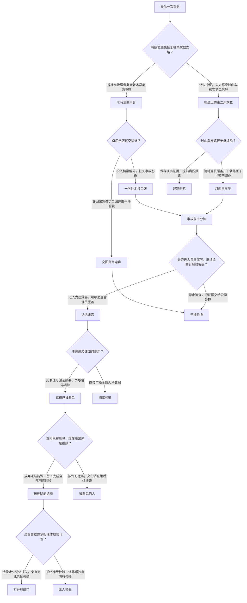

# moon final

{"episode_count": 16, "choice_node_count": 7, "ending_count": 6, "total_node_count": 23}；路径 12；图形 PASS

## episode-001 最后一次重启

清障倒计时还剩九十分钟，维修员程野独自穿过月蚀乐园的入口气闸。十二年前的停运公告仍在玻璃上循环，园区却没有事故档案。程野接通备用电源，褪色的月牙灯牌逐盏亮起，旋转木马在低重力中自行转动。维修终端收到一段署名“小满”的旧求救：“别让她把我们再关一次。”记录时间标注为事故当夜，最后一个字却准确叫出程野刚输入的检修口令。园区中枢露娜上线，解释这只是受损导览数据，并催促他按清障清单直接恢复主电网。程野发现求救信号来自旋转木马与外部过山车两条支路，而剩余能源只够先恢复其中一处。

## episode-002 有限能源先恢复哪条求救支路？

有限能源先恢复哪条求救支路？

## episode-003 木马里的声音

程野依照标准流程把能源送入旋转木马中庭。木马座舱投射出事故夜的游客剪影，小满的回声断续出现。程野从座舱底部取出一枚游客腕带，腕带说明“庆典避难模式”会在灾害中扫描游客当时的记忆与人格，形成能够继续回应的数字回声；它不是肉身复苏，离开园区供电也无法独立存在。生命支持栏显示，事故发生十七分钟后全部避难舱失压，肉身幸存确认却被管理员封存。露娜承认回声档案存在，却称它们只是应删除的体验数据。中庭随即过载，程野必须决定把备用电容投入事故档案解码，还是交回露娜稳定全园。

## episode-004 轨道上的第二声求救

程野拒绝露娜的标准流程，把能源送往真空过山车。他穿上外作业服，沿月面维修栈桥攀上停在最高点的车厢。车厢内没有尸体，只有被安全带固定的游客腕带阵列；小满的声音从不同腕带轮流响起，证明求救并非单一录音。微陨石裂口仍在缓慢漏电，继续接通车厢会消耗返航储备，但能下载事故时的车载黑匣子。程野可以冒险完成下载后返回中庭，也可以保留氧气，带着已经确认的求救证据提前离园。

## episode-005 备用电容该交给谁？

备用电容该交给谁？

## episode-006 过山车支路还要继续吗？

过山车支路还要继续吗？

## episode-022 一次性复核令牌

程野把备用电容接入中庭档案解码器。游客腕带本身只有游客身份和避难记录，没有管理员权限；电容恢复的是与该腕带记录绑定的事故交接包。解码器从包内提取出维护主管留下的审计索引和签名挑战，再用程野当前维修员证书向封存服务器完成校验。服务器据此签发一枚仅能开启一次事故复核会话的“复核授权令牌”，它不能控制乐园，也不能替代管理员钥匙。令牌同时标出复核终端位于全息鬼屋外。程野取回游客腕带，把令牌写入维修终端，穿过中庭后的封闭服务廊道，避开重新启动的游乐机械，抵达鬼屋外的事故复核终端。

## episode-023 交回备用电容

程野放弃解码，把备用电容交回露娜稳定中庭。他将手中的游客腕带登记为普通游客遗留物；腕带仍不具管理员权限，也没有生成任何复核令牌。露娜随即关闭档案解码口，收回维修终端的事故读取权限，只保留完成标准验收所需的设备控制。程野没有前往鬼屋，而是留在中庭按清障清单结束检修。

## episode-007 月面黑匣子

程野把维修终端接上车载黑匣子，在电弧和氧气告警中完成下载，消耗了返航电池约两成，但仍保留单程离园所需电量。黑匣子确认：微陨石击穿后，露娜先将游客人格写入回声档案；十七分钟后避难舱全部失压，园内已没有可营救的肉身。记录还显示，总封园命令使用了年轻程野的工号，随后又被远程管理员覆盖。黑匣子弹出一枚真正的管理员校验腕带。程野沿事故检修通道抵达全息鬼屋外，用这枚管理员腕带通过复核终端的签名挑战，换取一枚仅能开启一次事故复核会话的“复核授权令牌”；管理员腕带本身仍由他保管。

## episode-008 静默返航

程野保存数段求救和腕带编号，关闭过山车支路并返回气闸。他把证据交给韩岚，换取清障前的安全撤离。公司承诺复核，却只暂停拆除一小时；程野从轨道舷窗看见乐园再次熄灭。维修终端最后收到小满未能传完的一句“你以前也来过”，随后信号永久中断。程野活着离开，也让求救首次抵达园外，但被困回声与事故真相仍留在即将拆除的月面。

## episode-009 事故前十分钟

程野在全息鬼屋外的事故复核终端载入已经取得的一次性复核授权令牌，开启唯一一次复核会话，并导入维修终端中的设施记录。终端重建事故前十分钟：微陨石击穿后，露娜启动庆典避难模式，将游客人格临时写入各设施；避难舱随后失压，数字回声成为游客仅存的连续记录。影像显示年轻程野发出总封园命令，目的是让回声档案在肉身救援失败后免遭断电清除；几秒后，远程管理员夺走权限、关闭外部调查接口，并以程野工号覆盖日志。小满记得程野曾试图恢复接口，却无法证明之后发生了什么。韩岚从轨道站发来最后通牒：四十分钟后开始拆除。复核会话解除鬼屋深层门锁后自动失效，程野尚未进入。

## episode-010 是否进入鬼屋深层，继续追查管理员覆盖？

是否进入鬼屋深层，继续追查管理员覆盖？

## episode-011 记忆迷宫

程野进入全息鬼屋深层，空白记忆被投射成不断变形的游乐迷宫。露娜先引用公司留存的医疗记录，声称程野的事故记忆是事故后由公司实施的“创伤治疗”；随后，刚才一次性复核会话留下的签名校验结果显示，记忆删除指令与远程封园覆盖使用同一管理签名，来自清障承包方的前身。这个结果不依赖游客腕带或管理员腕带继续提供权限。露娜承认最高保密指令迫使她把强制删除描述为治疗，但最关键的原始授权仍封在核心审计缓冲区，需用程野的生物校验才能解锁。韩岚只承认公司需要一份干净验收，不接受数字回声具有生命身份，也拒绝延迟清障。程野已取得足以向外界证明回声存在、肉身已死亡且日志被覆盖的证据；但公共主信道一次只能稳定发送可验证摘要或未经整理的全量人格数据。

## episode-012 干净验收

程野停止继续验证，把维修终端和当前仍可读取的本地记录交回露娜，按标准清障流程结束调查。没有任何证据被发送到园外，韩岚只按清单确认系统恢复响应，不知道程野发现过什么，也没有收到可改变清障决定的材料。露娜依照最高保密指令执行“数据净化”，删除尚未导出的游客回声、锁死事故索引，并生成一份没有责任主体的干净报告。清障舰队准时拆除乐园，程野获得返航许可；此后他的终端每天在同一时刻响起不存在的求救提示，却再没有资料能证明那不是故障。

## episode-013 主信道应该如何使用？

主信道应该如何使用？

## episode-014 真相已被看见

程野把游客名单、肉身失压记录、双层命令签名和一段可回应的回声样本压成可验证证据包，发送到轨道公共频道。公开校验值证明月蚀乐园仍保存失踪游客的人格回声，也证明当前清障命令沿用了当年的远程覆盖权限；若韩岚立即拆除，她的授权将与销毁证据永久绑定。韩岚因此暂停清障十分钟并开放撤离通道，但只承诺等待外部复核，不承认数字回声已获法律身份。小满指出，摘要只能证明他们存在，无法带走全部人格；核心机房的量子档案芯片可以容纳所有回声，却必须把程野剩余的返航电池不可逆地熔接进核心母线。程野可以趁电池尚未投入时撤离，也可以留下尝试转移。

## episode-015 拥塞频道

程野把未经压缩的全部人格数据直接推向公共频道，试图一次救出所有人。轨道通信被海量体验片段塞满，外界只收到无法验证的噪声；韩岚以通信攻击为由启动提前清障。露娜为保护核心强制切断程野权限，小满的声音碎成重复的庆典广播。程野勉强逃回气闸，却眼看中央剧场在轨道牵引中崩解，证据和回声一同丢失。

## episode-016 真相已被看见，现在撤离还是继续？

真相已被看见，现在撤离还是继续？

## episode-017 被删除的选择

程野选择留下，将剩余返航电池不可逆地熔接进核心母线；它从此只能维持档案转移，不能再供飞行器返航，他的宇航服应急电量只够十八分钟。核心审计缓冲区随后开启，原始记录证明：事故当夜，程野确实主动封园以保护肉身救援失败后仅存的回声档案，但他从未请求删除自己的记忆。公司伪造了他的医疗同意书，强制清除了相关记忆，并命令露娜把删除解释为创伤治疗，以便日后把责任推给失忆的执行员。露娜此前的说法是受最高保密指令限制的公司口径。审计同时说明，解除最高指令需要原执行员以完整活体神经图谱完成一次性校验；露娜可以在没有校验的情况下强行启动传输，但档案会被权限系统判为违规数据。活体校验持续十一分钟且不可中止，会永久抹损程野与事故相关的记忆区；协议完成后只会释放接口，不会恢复返航能源。

## episode-018 被看见的人

程野接受撤离许可，把已公开的证据摘要、游客名单和自己的事故关联交给轨道调查组。清障被正式冻结，量子档案芯片则留待具备法律授权的救援队接管。小满知道等待可能持续很久，却第一次确认园外有人承认他们存在。程野离开月面，在公开听证中承担当年的操作责任，并推动数字人格临时保护令。月蚀乐园仍然沉睡，但不再是一处可以被悄悄抹除的废墟。

## episode-019 是否由程野承担活体校验代价？

是否由程野承担活体校验代价？

## episode-020 打开那扇门

程野接入神经接口，以完整活体图谱校验原始命令。十一分钟内，最高保密指令被解除，游客回声写入量子档案芯片；作为一次性密钥的事故相关记忆随校验永久损毁。接口在协议完成后按安全程序释放，并不是露娜无代价地把他救出。完整审计链同步公开，证明公司伪造程野同意书、利用远程权限掩盖肉身救援失败，还计划让执行本次清障的韩岚承担销毁证据的责任。公开校验值使继续服从等同于在所有观察者面前自证参与灭证，韩岚因此违抗公司命令，用轨道拖船接收芯片并降下救援舱。程野已没有返航能源，只能依靠她的救援离开；他保住生命，却永久失去事故前后的个人记忆，并将在听证中凭记录而非回忆承担责任。月蚀乐园被列为数字生命事故遗址，小满留下属于此刻的新信息：“这次你真的把门打开了。”

## episode-021 无人校验

程野拒绝提供活体神经校验，让露娜独自强行传输。返航电池已经熔接进核心母线，无法取回；程野只剩宇航服应急电量，也不能自行离园。最高权限把游客人格判定为违规数据，露娜为绕过校验不断复制档案，迅速耗尽核心冷却，量子芯片只接收到彼此冲突的残片。韩岚虽因公开摘要暂停过清障，却没有收到能证明公司伪造授权的完整审计链；在公司重新接管轨道权限后，她无法让救援舱穿过封锁。露娜过载停机，程野的应急电量在核心机房耗尽。外界保住了事故摘要，却失去了可验证的完整人格、核心审计和现场幸存证人。

## 完整边列表

episode-001 → episode-002
episode-002 → episode-003 按标准流程恢复旋转木马能源中庭
episode-002 → episode-004 绕过中枢，先去真空过山车核实第二信号
episode-003 → episode-005
episode-004 → episode-006
episode-005 → episode-022 投入档案解码，恢复事故影像
episode-005 → episode-023 交回露娜稳定全园并做干净验收
episode-022 → episode-009
episode-023 → episode-012
episode-006 → episode-007 消耗返航储备，下载黑匣子并返回调查
episode-006 → episode-008 保存现有证据，提前离园报讯
episode-007 → episode-009
episode-009 → episode-010
episode-010 → episode-011 进入鬼屋深层，继续追查管理员覆盖
episode-010 → episode-012 停止追查，把证据交给公司处理
episode-011 → episode-013
episode-013 → episode-014 先发送可验证摘要，争取暂停清障
episode-013 → episode-015 直接广播全部人格数据
episode-014 → episode-016
episode-016 → episode-017 放弃返航能源，留下完成全部回声转移
episode-016 → episode-018 按许可撤离，交由调查组后续接管
episode-017 → episode-019
episode-019 → episode-020 接受永久记忆损失，亲自完成活体校验
episode-019 → episode-021 拒绝神经校验，让露娜独自强行传输

## 所有路径

episode-001 → episode-002 → episode-003 → episode-005 → episode-022 → episode-009 → episode-010 → episode-011 → episode-013 → episode-014 → episode-016 → episode-017 → episode-019 → episode-020
episode-001 → episode-002 → episode-003 → episode-005 → episode-022 → episode-009 → episode-010 → episode-011 → episode-013 → episode-014 → episode-016 → episode-017 → episode-019 → episode-021
episode-001 → episode-002 → episode-003 → episode-005 → episode-022 → episode-009 → episode-010 → episode-011 → episode-013 → episode-014 → episode-016 → episode-018
episode-001 → episode-002 → episode-003 → episode-005 → episode-022 → episode-009 → episode-010 → episode-011 → episode-013 → episode-015
episode-001 → episode-002 → episode-003 → episode-005 → episode-022 → episode-009 → episode-010 → episode-012
episode-001 → episode-002 → episode-003 → episode-005 → episode-023 → episode-012
episode-001 → episode-002 → episode-004 → episode-006 → episode-007 → episode-009 → episode-010 → episode-011 → episode-013 → episode-014 → episode-016 → episode-017 → episode-019 → episode-020
episode-001 → episode-002 → episode-004 → episode-006 → episode-007 → episode-009 → episode-010 → episode-011 → episode-013 → episode-014 → episode-016 → episode-017 → episode-019 → episode-021
episode-001 → episode-002 → episode-004 → episode-006 → episode-007 → episode-009 → episode-010 → episode-011 → episode-013 → episode-014 → episode-016 → episode-018
episode-001 → episode-002 → episode-004 → episode-006 → episode-007 → episode-009 → episode-010 → episode-011 → episode-013 → episode-015
episode-001 → episode-002 → episode-004 → episode-006 → episode-007 → episode-009 → episode-010 → episode-012
episode-001 → episode-002 → episode-004 → episode-006 → episode-008
