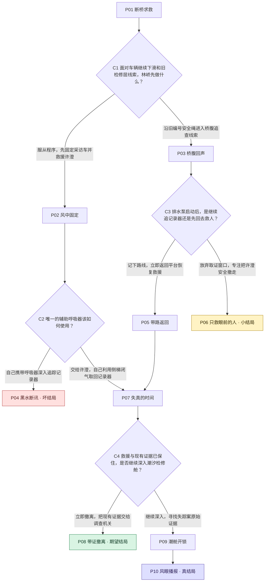
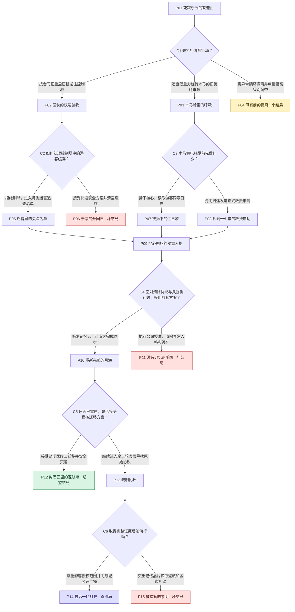

# 流程图 Skill 0.19：两组线上测试

2026-09-10。仅同步已授权测试 Skill episode-route-designer-biz（06e9a31d-b667-4124-948b-fcc2e79accf0）；10个源文件回读逐字一致。沿用“蚂蚱的测试”默认配置，未修改编剧、平台或正式资源。测试预设前后回读JSON完全一致。测试到 PLANNING_ACCEPTED，未生成完整剧本。

## 实测

一集是一个非选择剧情节点，含结局；选择卡单独统计。时长是用户故事规模设定，不是机器验证的播放时长。

| 故事 | 设定 | 集数 | 选择卡/选项 | 总节点 | 结局 | 完整路径 | 条件分岔深度 | 独立回汇点 | 图形结果 | 端到端耗时 |
|---|---|---:|---|---:|---|---:|---:|---:|---|---|
| 风眼之桥 | 40分钟 | 10 | 4 / 8 | 14 | 小1、期望1、坏1、真1 | 6 | 3 | 1 | PLANNING_ACCEPTED | 9分40.5秒 |
| 月海乐园：最后一轮月光 | 60分钟 | 15 | 6 / 13 | 21 | 小1、期望1、坏3、真1 | 14 | 5 | 1 | PLANNING_ACCEPTED | 6分21.2秒 |

两组无用户豁免，四类结局、交叉、嵌套深度和递进结局均通过。深度按“后续选择仅在部分选项路线出现”计算，不等于连续剧情段数；科幻有两份交叉证据但共享同一个回汇点，不能算两处回汇。两组达到复杂度下限；仅一处回汇仍偏克制，这不能证明复杂度已最大化，也不能以不同题材样本证明优于0.46或速度更快。

耗时从本地发起首条消息到服务端 runtime.completed，含加载、上游企划、等待和报告导出。作者原报告的约149/157秒仅覆盖后段规划，不能作为总运行时间。

## 恢复与局限

- 两组均首次图形提交通过（revision 1），图形返工0，主线改动0，缓存从头重跑0。26项本地契约测试覆盖失败项局部修复；本次线上没有触发图形失败，未实测线上图形恢复。
- 悬疑例辅助顺读脚本发生一次 KeyError（混用临时图ID和对外ID）；同缓存修正辅助脚本、重做顺读后重新accept/verify。初次shell未遇错停止，曾先执行accept。记录为1次工程恢复，非图形修复；Skill文件未改。另有画风目录检索转列表及一次画风选项应答，不算图形恢复。
- 科幻例无记录到的恢复。
- 两组作者自报“无剧情问题”不能作为独立内容验收。回读发现以下问题，未改冻结主线，未掩盖原始产物。

### 作者内容问题

1. 悬疑 `cache/topology-state.json` 支线 s2 / 对外 episode-008（展示P05）结尾说“局面回到必须分配唯一辅助呼吸器的关口”，却直接连接 n3 / episode-010（P07），后者自动把呼吸器交给许澄。这不是正文提前执行已列出的选择，而是支线提出的可选择裂口没有落实；该支线没有经过呼吸器选择卡。另c4（展示C3）题目问“继续追还是回救人”，实际两个选项都是返回，区别是保留取证机会还是彻底撤离，题目与选项不够准确。
2. 科幻 `cache/mainline.json` m4 / episode-012（P09）使用“无论…可能…也可能”的条件说明；m5 / episode-014（P10）沿用“黑匣子或同意记录”。b3来路正文只建立救援申请与见证，未充分建立后文需要的同意记录。这仍需作者补足真实事件承接，不能把条件说明当作已经写好的单一故事。

上述问题不由机器图形检查判定。当前完整故事切片投影、哈希和图形均独立验证通过，但“作者材料稳定可交给编剧”尚未完全达标。不能宣称所有剧情质量已通过，也没有加语义引擎替代作者责任。

## 本地实现验证

26项行为契约测试通过；官方Skill quick_validate通过；独立回读两个线上缓存，重算图形、路径、切片投影和验收文件哈希通过；冻结主线未改变。旧增长/A-B/语义状态脚本已移除，旧缓存不直接迁移。

## 原始材料与图

以下图由正式route-candidate.json的实际边生成；方框为剧集，菱形为选择卡。完整选项、边和原文切片在各组test-report.md、结果图与完整剧集材料.md及cache目录，作者原报告保留原样，以上独立审计纠正其局限。

### 风眼之桥

[完整剧集材料](bridge-result/结果图与完整剧集材料.md) · [原始测试报告](bridge-result/test-report.md)

### 月海乐园：最后一轮月光

[完整剧集材料](moon-result/结果图与完整剧集材料.md) · [原始测试报告](moon-result/test-report.md)
