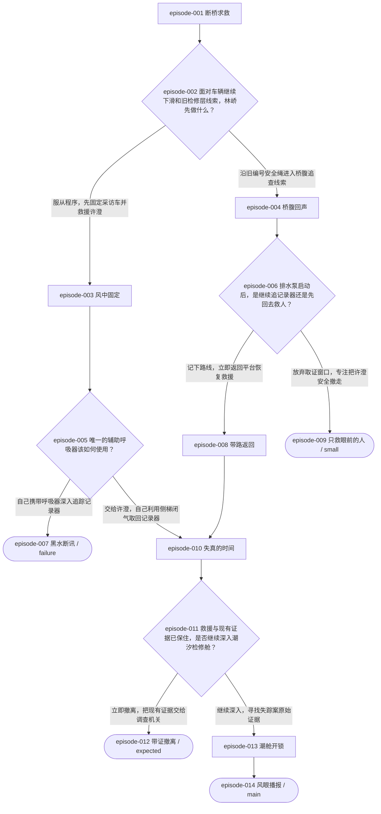

# 路线规划隔离测试报告：风眼之桥

## 测试结论
- 项目身份：`test-route019-evolved-bridge`（明确测试身份）
- Skill：`episode-route-designer-biz` 0.19
- 最终真实状态：**PLANNING_ACCEPTED**
- 验收范围：`graph-and-projection-only; plot is author responsibility`
- 说明：机器 PASS 仅验证图形、输入合同与原文切片投影；剧情连续性由作者顺读负责，未宣称机器验证剧情。
- 未生成媒体、完整剧本或正式项目文件；accept 未传正式输出路径。

## 标题与一句话
- 标题：风眼之桥
- 一句话：台风封桥之夜，一名海上救援员为救坠桥记者闯入废弃检修层，却发现事故与十二年前姐姐失踪案共享同一套被篡改的桥梁监测记录。
- 锁定画风：现代都市（真实目录 ID 11；仅用于企划与文字资产，本测试不生图）

## 规模统计
- 剧情集数（非选择节点，含结局）：10
- 选择卡数：4
- 选项数：8
- 总节点数：14
- 结局数：4
- 结局分类：小结局 small × 1；期望结局 expected × 1；坏结局 failure × 1；真结局 main × 1
- 完整路径数：6

## 全部节点一句话展示摘要
- episode-001｜断桥求救｜剧情：台风“鹭眼”逼近海湾，跨海大桥在封桥后仍传来一辆采访车坠入检修平台的报警。救援潜水员林峤随队抵达，风把桥面护栏吹得持续震颤，海水已经漫过下层通道。值守主管顾崇山声称事故只涉及…
- episode-002｜面对车辆继续下滑和旧检修层线索，林峤先做什么？｜选择卡：面对车辆继续下滑和旧检修层线索，林峤先做什么？
- episode-003｜风中固定｜剧情：林峤服从周岚，冒着横风爬到采访车外侧，把备用绞盘接上主梁。他在车辆继续下坠前托住许澄，并从她胸前相机带里取出半张被海水浸透的检修层平面图。许澄承认，她收到匿名短信，知道十二年…
- episode-004｜桥腹回声｜剧情：林峤没有先固定车辆，而是沿旧编号安全绳钻入桥腹。他在黑暗中找到被水流卡住的防水记录器定位灯，也发现一串用红漆标出的检修标记；那是林汐小时候教他辨认方向时常画的箭头。许澄通过断…
- episode-005｜唯一的辅助呼吸器该如何使用？｜选择卡：唯一的辅助呼吸器该如何使用？
- episode-006｜排水泵启动后，是继续追记录器还是先回去救人？｜选择卡：排水泵启动后，是继续追记录器还是先回去救人？
- episode-007｜黑水断讯｜结局-failure：林峤把辅助呼吸器留给自己，独自潜入快速灌水的排水井。没有呼吸器的许澄在平台上因失血与缺氧陷入昏迷，周岚被迫中止吊运去维持她的生命。林峤追到记录器时，顾崇山启动排水闸，回流把安…
- episode-008｜带路返回｜剧情：林峤放弃眼前的定位灯，记下红漆箭头后爬回事故平台。他用箭头位置校正许澄的半张平面图，确认排水井与潮汐检修舱属于同一条旧通道。周岚责备他擅离救援位，却在看见红漆标记照片后承认那…
- episode-009｜只救眼前的人｜结局-small：林峤立刻返回平台，与周岚合力固定采访车，并把许澄吊上救援篮。顾崇山以桥体失稳为由关闭全部下层入口，直升机在风墙合拢前带走三人。许澄保住性命，却失去了随水冲走的记录器；她掌握的…
- episode-010｜失真的时间｜剧情：林峤把呼吸器交给许澄，再用短绳下降到较浅的排水井。他在不长时间闭气往返中捞回防水记录器，里面保存着今晚桥梁传感器先报警、采访车后被工程车逼停的影像；记录器还复制了十二年前一段…
- episode-011｜救援与现有证据已保住，是否继续深入潮汐检修舱？｜选择卡：救援与现有证据已保住，是否继续深入潮汐检修舱？
- episode-012｜带证撤离｜结局-expected：林峤决定不再深入潮汐检修舱。他把许澄和防水记录器一起送上吊篮，周岚则用救援频道保存了自己承认篡改时间轴的录音。三人在主梁断裂前撤到东侧匝道，顾崇山无法回收记录器，只能关闭桥梁…
- episode-013｜潮舱开锁｜剧情：林峤选择继续，要求周岚把许澄送上吊篮，自己凭半张平面图冲向潮汐检修舱。周岚没有阻拦，反而交出珍藏十二年的机械钥匙，并坦白她当年在封闭门外听见林汐吹响红色救生哨，却因顾崇山谎称…
- episode-014｜风眼播报｜结局-main：林峤把原始存储卡的校验摘要和许建国录音送入应急广播，周岚在指挥车内用自己的权限解除静默。顾崇山试图覆盖频道，许澄则在撤离吊篮上用防水记录器同步录下广播与实时桥况，使证据同时进…

## 全部选择与选项
- episode-002 面对车辆继续下滑和旧检修层线索，林峤先做什么？：option-001 服从程序，先固定采访车并救援许澄 → episode-003；option-002 沿旧编号安全绳进入桥腹追查线索 → episode-004
- episode-005 唯一的辅助呼吸器该如何使用？：option-001 交给许澄，自己利用侧梯闭气取回记录器 → episode-010；option-002 自己携带呼吸器深入追踪记录器 → episode-007
- episode-006 排水泵启动后，是继续追记录器还是先回去救人？：option-001 记下路线，立即返回平台恢复救援 → episode-008；option-002 放弃取证窗口，专注把许澄安全撤走 → episode-009
- episode-011 救援与现有证据已保住，是否继续深入潮汐检修舱？：option-001 立即撤离，把现有证据交给调查机关 → episode-012；option-002 继续深入，寻找失踪案原始证据 → episode-013

## 完整边列表
- edge-001: episode-001 --default--> episode-002
- edge-002: episode-002 --choice--> episode-003
- edge-003: episode-002 --choice--> episode-004
- edge-004: episode-003 --default--> episode-005
- edge-005: episode-004 --default--> episode-006
- edge-006: episode-005 --choice--> episode-010
- edge-007: episode-005 --choice--> episode-007
- edge-008: episode-006 --choice--> episode-008
- edge-009: episode-006 --choice--> episode-009
- edge-010: episode-008 --default--> episode-010
- edge-011: episode-010 --default--> episode-011
- edge-012: episode-011 --choice--> episode-012
- edge-013: episode-011 --choice--> episode-013
- edge-014: episode-013 --default--> episode-014

## Mermaid

## 图形检查结果
- 总状态：PASS
- 失败项：[]
- 统计：`{"episode_count": 10, "choice_node_count": 4, "ending_count": 4, "total_node_count": 14}`
- 路径数：6；选项数：8
- ending_types: PASS；证据 `{"expected": ["e_expected"], "failure": ["e_fail"], "main": ["n5"], "small": ["e_small"]}`
- small: PASS；证据 `["e_small"]`
- crossing: PASS；证据 `[{"choice": "c1", "merge": "n3", "paths": [["n2", "c2", "n3"], ["s1", "c4", "s2", "n3"]]}]`
- depth: PASS；证据 `{"depth": 3, "choices": ["c1", "c2", "c3"]}`
- immediate_result: PASS；证据 `[]`
- ending_distribution: PASS；证据 `{"e_fail": ["c2"], "n5": ["c3"], "e_expected": ["c3"]}`
- progressive_ending: PASS；证据 `[{"choice": "c3", "expected_arm": "e_expected", "true_arm": "n4"}]`

## 作者剧情顺读
- 顺读路径数：6
- 作者发现的剧情问题：[]
- 可扩写性：PASS：全部非选择节点提供可直接扩写的处境、行动、阻力、变化和停止位置。
- 选择时点：PASS：四张选择卡前均停在动作未执行处，八个选项先落到独立剧情节点。
- 汇合承接：PASS：两条初始救援路线在n3回汇；共同成立的是许澄已获稳定和记录器可取，红漆箭头与侧梯信息仅在其来路保留，不要求另一支路拥有。
- 结局结算：PASS：small为安全撤离但旧案封存；expected为救援成功并启动复查但真相不全；failure为救援与证据双重重创；main为完整证据公开并承担关系与伤亡代价。
- 用户约束：PASS：台风夜、跨海大桥、救援牵出十二年前失踪案贯穿全部路线；40分钟仅用于非短故事分类。

## 完整故事材料保留位置
- 冻结主线完整原文及逐字切片：`cache/mainline.json`
- 完整支线原文、逐字切片与正式图：`cache/topology-state.json`（同内容首次提交见 `cache/submission-v1.json`）
- 逐节点原文投影：`cache/route-candidate.json`
- 六条完整路径：`cache/all-paths.txt`
- 作者顺读记录：`cache/author-readthrough.json`

## 恢复记录
- 恢复次数：1
- 恢复原因：首次作者顺读脚本误把临时拓扑ID当作投影episode ID，KeyError后shell未启用-e导致accept先执行；未改故事、图形、冻结主线或验收标准。
- 恢复动作：在同缓存按临时拓扑ID重做作者顺读，随后重新accept并verify。
- 图形修复次数：0（首次正式候选即图形 PASS；未修改冻结主线）
- 真实失败记录：首次作者顺读辅助脚本发生 `KeyError: e_expected`，原因是混用临时拓扑 ID 与投影 episode ID；已在同缓存修正复核脚本。故事、图形、时长、验收标准和冻结主线均未改变。

## 时间
- 开始时间：2026-09-10T12:05:14.733375+00:00
- 最终报告时间：2026-09-10T12:07:51.359843+00:00
- 总耗时：156.626 秒
- 规划验收时间：2026-09-10T12:07:08.780032+00:00

## 哈希与版本
- 拓扑 revision：1
- 拓扑 hash：`b492b3e29b227c02340dcddd9581dfac872d57646c5826f83e21a37cdbfbccd9`
- 验收绑定文件：`{"mainline-lock.json": "ac81436f9d3c309f551bfce34c73e6c2716b07d847ef9392ad93796f89e64a17", "topology-state.json": "ef72d9c4fa536b2f2a495b1bd4d5b2cc7e05a0d9fddf4fe916a9caa2b96e7d93", "graph-report.json": "80067e055966b5aba23f3af2d45a58f1e9a720577606febedac626e844e8aac0", "route-candidate.json": "4668ae32a1d01d35017deb89fdec2603ff031db1d9b7f2418626c6a6dbe24519"}`
