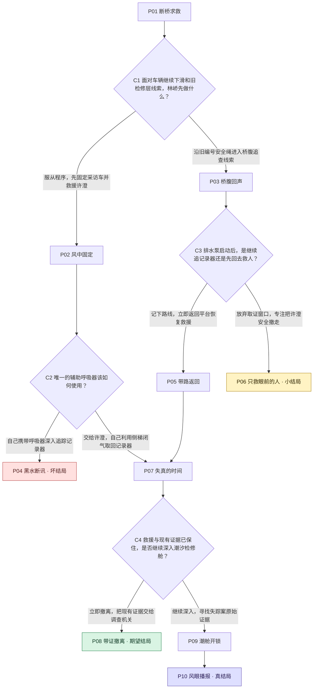

# 风眼之桥

台风封桥之夜，一名海上救援员为救坠桥记者闯入废弃检修层，却发现事故与十二年前姐姐失踪案共享同一套被篡改的桥梁监测记录。

40分钟设定；10集 + 4选择卡；4结局；6路径。PLANNING_ACCEPTED独立回读验证通过。

方框是一集（含结局），菱形为选择卡。P/C为展示编号，与正式节点ID对应见下表。

| 展示编号 | 正式ID | 标题 |
|---|---|---|
| P01 | episode-001 | 断桥求救 |
| C1 | episode-002 | 面对车辆继续下滑和旧检修层线索，林峤先做什么？ |
| P02 | episode-003 | 风中固定 |
| P03 | episode-004 | 桥腹回声 |
| C2 | episode-005 | 唯一的辅助呼吸器该如何使用？ |
| C3 | episode-006 | 排水泵启动后，是继续追记录器还是先回去救人？ |
| P04 | episode-007 | 黑水断讯 |
| P05 | episode-008 | 带路返回 |
| P06 | episode-009 | 只救眼前的人 |
| P07 | episode-010 | 失真的时间 |
| C4 | episode-011 | 救援与现有证据已保住，是否继续深入潮汐检修舱？ |
| P08 | episode-012 | 带证撤离 |
| P09 | episode-013 | 潮舱开锁 |
| P10 | episode-014 | 风眼播报 |

完整原文分集材料：

## P01 断桥求救

台风“鹭眼”逼近海湾，跨海大桥在封桥后仍传来一辆采访车坠入检修平台的报警。救援潜水员林峤随队抵达，风把桥面护栏吹得持续震颤，海水已经漫过下层通道。值守主管顾崇山声称事故只涉及一名违规闯入的记者，并要求救援队沿公开通道速救速撤。林峤从破碎车窗里听见许澄的求救，她说自己腿被压住，随身的防水记录器被冲进桥腹，还喊出了林峤失踪姐姐林汐的名字。周岚命令林峤先固定车辆，禁止进入被标为坍塌风险区的旧检修层。林峤在断裂安全绳上发现十二年前救援队才使用的旧编号，意识到今晚事故并非单纯交通意外。车辆又向海面滑动半米，他必须在服从救援程序与追随旧编号进入桥腹之间作出决定。

## P02 风中固定

林峤服从周岚，冒着横风爬到采访车外侧，把备用绞盘接上主梁。他在车辆继续下坠前托住许澄，并从她胸前相机带里取出半张被海水浸透的检修层平面图。许澄承认，她收到匿名短信，知道十二年前失踪的检修工程师许建国和林汐曾把原始监测数据藏在潮汐检修舱。顾崇山通过无线电催促他们撤离，随后切断了旧检修层的照明。周岚听到许建国的名字后短暂失语，却仍命令林峤只救人、不碰证据。许澄的腿伤开始失血，而记录器的定位信号显示它卡在桥腹排水井附近。林峤只有一套可维持十分钟的辅助呼吸器，既可以交给许澄争取转移时间，也可以自己带着它进入积水通道取回记录器。

## P03 桥腹回声

林峤没有先固定车辆，而是沿旧编号安全绳钻入桥腹。他在黑暗中找到被水流卡住的防水记录器定位灯，也发现一串用红漆标出的检修标记；那是林汐小时候教他辨认方向时常画的箭头。许澄通过断续无线电告诉他，半张平面图在自己相机带里，只有带回平台才能拼出潮汐检修舱入口。顾崇山远程开启排水泵，积水迅速上涨，林峤若继续追定位灯，可能拿到记录器却赶不上车辆下滑；若立刻返回桥面，他能帮助许澄并保留林汐箭头指向的路线。

## P04 黑水断讯

林峤把辅助呼吸器留给自己，独自潜入快速灌水的排水井。没有呼吸器的许澄在平台上因失血与缺氧陷入昏迷，周岚被迫中止吊运去维持她的生命。林峤追到记录器时，顾崇山启动排水闸，回流把安全绳卷进叶轮。林峤虽然把记录器夹进救生衣，却被困在格栅另一侧；无线电只传回他断续说出的旧案时间戳。桥段发生二次断裂，许澄获救但永久失去一条腿，林峤没能返回。运营公司随后以救援员擅自行动解释全部伤亡，记录器也随残骸沉海。周岚终于公开自己的旧证词，却因缺少物证无法推动重查。

## P05 带路返回

林峤放弃眼前的定位灯，记下红漆箭头后爬回事故平台。他用箭头位置校正许澄的半张平面图，确认排水井与潮汐检修舱属于同一条旧通道。周岚责备他擅离救援位，却在看见红漆标记照片后承认那是林汐失踪当晚留下的最后现场痕迹。采访车仍被风推向桥外，林峤重新接上备用绞盘，局面回到必须分配唯一辅助呼吸器的关口；不同的是，他已知道排水井下方存在可供闭气往返的侧梯。

## P06 只救眼前的人

林峤立刻返回平台，与周岚合力固定采访车，并把许澄吊上救援篮。顾崇山以桥体失稳为由关闭全部下层入口，直升机在风墙合拢前带走三人。许澄保住性命，却失去了随水冲走的记录器；她掌握的半张平面图无法单独证明旧案。林峤只留下红漆箭头的照片和关于姐姐的新疑问。数日后，大桥运营公司把事故归结为记者违规闯入，旧检修层被永久灌封。林峤没有再冒险进入桥腹，他完成了一次无可指责的救援，却只能接受失踪案再次沉入海底。

## P07 失真的时间

林峤把呼吸器交给许澄，再用短绳下降到较浅的排水井。他在不长时间闭气往返中捞回防水记录器，里面保存着今晚桥梁传感器先报警、采访车后被工程车逼停的影像；记录器还复制了十二年前一段缺失的值班时间轴。林峤返回平台时，周岚亲自下到车旁协助止血。面对证据，她承认当年顾崇山命令她把“非法试运行”改写为“台风设备故障”，但坚称自己没有看见林汐和许建国坠海。顾崇山启动主塔远程排水，试图把检修层内的物证冲入海中，同时宣布桥面结构将在十五分钟后失稳。许澄已能被吊运离开，记录器也足以证明今晚有人蓄意灭证；然而潮汐检修舱里可能还留着能解释两名失踪者命运的原始存储卡。救援直升机只能再靠近一次，林峤必须决定带着现有证据撤离，还是把已经获救的结果继续押在一次深入行动上。

## P08 带证撤离

林峤决定不再深入潮汐检修舱。他把许澄和防水记录器一起送上吊篮，周岚则用救援频道保存了自己承认篡改时间轴的录音。三人在主梁断裂前撤到东侧匝道，顾崇山无法回收记录器，只能关闭桥梁服务器。许澄公布今晚工程车逼停采访车、运营方远程灭证以及周岚证词，警方据此拘留顾崇山并启动对十二年前失踪案的复查。林峤完成救援，也让掩盖链第一次出现裂口；但潮汐检修舱在风暴中坍塌，林汐与许建国最后去向的原始存储卡再也无法取出。案件获得法律入口，却只得到部分真相。

## P09 潮舱开锁

林峤选择继续，要求周岚把许澄送上吊篮，自己凭半张平面图冲向潮汐检修舱。周岚没有阻拦，反而交出珍藏十二年的机械钥匙，并坦白她当年在封闭门外听见林汐吹响红色救生哨，却因顾崇山谎称舱内存在燃气泄漏而撤走。林峤穿过被海水拍击的狭窄钢廊，在舱门内找到红色救生哨、许建国的录音设备和原始存储卡。录音证明非法试运行引发结构件脱落，林汐与许建国并未当场死亡；他们被顾崇山安排的工程船秘密带离，随后在转运途中遇险，求救坐标被人为删除。与此同时，顾崇山开始远程关闭防火门，企图把林峤困在舱内。林峤把存储卡接入维护终端，却发现外网断开，只有主塔应急广播仍与全桥和海事频道相连。

## P10 风眼播报

林峤把原始存储卡的校验摘要和许建国录音送入应急广播，周岚在指挥车内用自己的权限解除静默。顾崇山试图覆盖频道，许澄则在撤离吊篮上用防水记录器同步录下广播与实时桥况，使证据同时进入海事、消防和新闻备份。广播结束时，潮水冲断林峤的退路。周岚驾驶检修车撞开已关闭的防火门，以受伤为代价把林峤拖回主梁。海事部门根据被恢复的坐标找到当年工程船沉没位置，林汐和许建国的失踪终于从“个人逃离”改列为重大责任事故与刑事案件。顾崇山在东侧匝道被控制，运营公司非法试运行和今晚灭证的记录公开。林峤救回许澄，也取回姐姐留下的哨子，却必须面对周岚既曾沉默又在最后救他的复杂事实。风眼短暂越过大桥，天色并未放晴；他把救生哨交给调查人员，选择让真相进入漫长而公开的审判。
