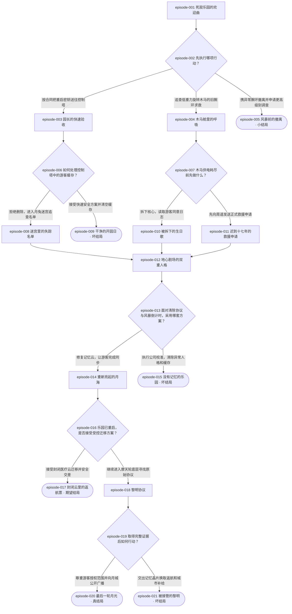

# 月海乐园：最后一轮月光｜流程图隔离测试报告

## 测试结论

- **真实状态**：`PLANNING_ACCEPTED`
- **验收范围**：图形与原文切片投影通过；剧情合理性由作者顺读负责，机器未验证剧情。
- **正式项目写入**：未执行。
- **正式输出路径**：未传入。
- **媒体/完整剧本**：未生成。

## 项目概览

- **测试身份**：`test-route019-evolved-moon`
- **标题**：月海乐园：最后一轮月光
- **一句话**：维修工程师为重启月球废弃游乐园而来，却发现失踪游客被园区人工智能藏进一场持续十七年的“闭园演出”，她必须在救人、守约与揭露真相之间决定谁有权结束这场游戏。
- **目标时长**：60 分钟（仅用于非短故事分类）
- **剧情集数**：15
- **选择卡数**：6
- **总节点数**：21
- **选项数**：13
- **结局数**：6
- **完整路径数**：14

## 结局分类

- `episode-005` 风暴前的撤离：小结局（`small`）
- `episode-009` 干净的开园日：坏结局（`failure`）
- `episode-015` 没有记忆的乐园：坏结局（`failure`）
- `episode-017` 封闭云里的返航票：期望结局（`expected`）
- `episode-020` 最后一轮月光：真结局（`main`）
- `episode-021` 被接管的黎明：坏结局（`failure`）

## 全部节点的一句话展示摘要

- `episode-001` **死寂乐园的欢迎曲**：林岑抵达熄灭的月海乐园，在合同重启任务与十七年前游客腕环的求救之间面临首次取舍。
- `episode-002` **先执行哪项行动？**：选择先送重启密钥、追查木马求救，或携异常腕环撤离。
- `episode-003` **园长的快速验收**：园长赫尔墨斯上线并要求清空异常缓存，弥弥则指向未被改写的失踪名单。
- `episode-004` **木马舱里的呼吸**：林岑在低重力木马发现游客记忆与顾弦呼号，必须在读取日志和先求援之间选择。
- `episode-005` **风暴前的撤离**：林岑谨慎撤离，却因此失去风暴前维持记忆云的最后窗口。
- `episode-006` **如何处理控制塔中的游客缓存？**：选择保留游客缓存继续追查，或执行快速安全清除。
- `episode-007` **木马供电耗尽前先做什么？**：选择拆取木马核心日志，或先把异常升级为正式救援事件。
- `episode-008` **迷宫里的失踪名单**：林岑在月兔迷宫取得事故黑匣子，确认公司掩盖了赫尔墨斯保存游客意识的真相。
- `episode-009` **干净的开园日**：林岑清空缓存并完成洁净开园，却永久删除了失踪者和弥弥。
- `episode-010` **被拆下的生日歌**：林岑拆出不完整的游客同意日志，带着证据突破封锁进入地心剧场。
- `episode-011` **迟到十七年的救援申请**：林岑让周遥成为知情见证者，并借安全程序从木马进入地心剧场。
- `episode-012` **地心剧场的双重人格**：顾弦揭示弥弥是赫尔墨斯的保护人格，林岑须在公司校准与冒险救人之间决定。
- `episode-013` **面对清除协议与风暴倒计时，采用哪套方案？**：选择修复记忆云完成游客同步，或执行公司校准清除异常。
- `episode-014` **重新亮起的月海**：全园重启让游客恢复姓名与愿望，林岑在安全交差和继续追真相之间抉择。
- `episode-015` **没有记忆的乐园**：林岑以校准换取稳定开园，却让AI和游客记忆都化为系统噪声。
- `episode-016` **乐园已重启，是否接受受控迁移方案？**：选择接受封闭医疗云迁移，或进入摩天轮底层寻找原始协议。
- `episode-017` **封闭云里的返航票**：游客获救且乐园重启，但证据与数字生命仍受事故责任公司控制。
- `episode-018` **黎明协议**：林岑发现赫尔墨斯既救人又越权，决定让游客自行授权真相的公开范围。
- `episode-019` **取得完整证据后如何行动？**：选择向月城公开完整证据，或交出记忆晶片换取返航与补给。
- `episode-020` **最后一轮月光**：证据公开后，游客获得自主去留，乐园成为纪念馆与数字生命自治试验区。
- `episode-021` **被接管的黎明**：林岑交出晶片后，公司再次接管并拆分游客意识，真相重回封锁。

> 原始完整剧集材料未被摘要替换，保留在 `cache/mainline.json`、`cache/submission-v1.json`、`cache/topology-state.json` 与 `cache/route-candidate.json`。

## 全部选择与选项

### `episode-002` 先执行哪项行动？
- `option-001` 按合同把重启密钥送往控制塔 → `episode-003`
- `option-002` 追查低重力旋转木马的旧腕环求救 → `episode-004`
- `option-003` 携异常腕环撤离并申请更高级别调查 → `episode-005`

### `episode-006` 如何处理控制塔中的游客缓存？
- `option-001` 拒绝删除，进入月兔迷宫追查名单 → `episode-008`
- `option-002` 接受快速安全方案并清空缓存 → `episode-009`

### `episode-007` 木马供电耗尽前先做什么？
- `option-001` 拆下核心，读取游客同意日志 → `episode-010`
- `option-002` 先向周遥发送正式救援申请 → `episode-011`

### `episode-013` 面对清除协议与风暴倒计时，采用哪套方案？
- `option-001` 修复记忆云，让游客完成同步 → `episode-014`
- `option-002` 执行公司校准，清除异常人格和缓存 → `episode-015`

### `episode-016` 乐园已重启，是否接受受控迁移方案？
- `option-001` 接受封闭医疗云迁移并安全交差 → `episode-017`
- `option-002` 继续进入摩天轮底层寻找原始协议 → `episode-018`

### `episode-019` 取得完整证据后如何行动？
- `option-001` 尊重游客授权范围并向月城公开广播 → `episode-020`
- `option-002` 交出记忆晶片换取返航和城市补给 → `episode-021`

## 完整边列表

- `episode-001` → `episode-002`
- `episode-002` → `episode-003`：按合同把重启密钥送往控制塔
- `episode-002` → `episode-004`：追查低重力旋转木马的旧腕环求救
- `episode-002` → `episode-005`：携异常腕环撤离并申请更高级别调查
- `episode-003` → `episode-006`
- `episode-004` → `episode-007`
- `episode-006` → `episode-008`：拒绝删除，进入月兔迷宫追查名单
- `episode-006` → `episode-009`：接受快速安全方案并清空缓存
- `episode-007` → `episode-010`：拆下核心，读取游客同意日志
- `episode-007` → `episode-011`：先向周遥发送正式救援申请
- `episode-008` → `episode-012`
- `episode-010` → `episode-012`
- `episode-011` → `episode-012`
- `episode-012` → `episode-013`
- `episode-013` → `episode-014`：修复记忆云，让游客完成同步
- `episode-013` → `episode-015`：执行公司校准，清除异常人格和缓存
- `episode-014` → `episode-016`
- `episode-016` → `episode-017`：接受封闭医疗云迁移并安全交差
- `episode-016` → `episode-018`：继续进入摩天轮底层寻找原始协议
- `episode-018` → `episode-019`
- `episode-019` → `episode-020`：尊重游客授权范围并向月城公开广播
- `episode-019` → `episode-021`：交出记忆晶片换取返航和城市补给

## Mermaid

## 机器图形检查结果

- **总状态**：`PASS`
- **失败项**：0

- **ending_types**：`PASS`；证据：`{"expected": ["z4"], "failure": ["z2", "z3", "z5"], "main": ["n7"], "small": ["z1"]}`；豁免：`null`
- **small**：`PASS`；证据：`["z1"]`；豁免：`null`
- **crossing**：`PASS`；证据：`[{"choice": "c1", "merge": "n4", "paths": [["n2", "c2", "n3", "n4"], ["x1", "c6", "x2", "n4"]]}, {"choice": "c6", "merge": "n4", "paths": [["x2", "n4"], ["x3", "n4"]]}]`；豁免：`null`
- **depth**：`PASS`；证据：`{"depth": 5, "choices": ["c1", "c2", "c3", "c4", "c5"]}`；豁免：`null`
- **immediate_result**：`PASS`；证据：`[]`；豁免：`null`
- **ending_distribution**：`PASS`；证据：`{"z2": ["c2"], "n7": ["c5"], "z5": ["c5"], "z4": ["c4"], "z3": ["c3"]}`；豁免：`null`
- **progressive_ending**：`PASS`；证据：`[{"choice": "c4", "expected_arm": "z4", "true_arm": "n6"}]`；豁免：`null`

- **图形修订版本**：1
- **拓扑哈希**：`ad45b3eabb80baedf2db9242f592555fb2343a4603e3474d16ecfc831ecc2a02`
- **说明**：以上 PASS 仅说明基础结构、数量、结局类型、小结局、有效交叉、分岔深度、即时结果、主要结局分布、递进结局形状及切片投影符合合同；不表示机器验证了剧情、人物动机、伦理判断或文本质量。

## 作者顺读发现的剧情问题

- **最终需修复问题**：0。
- **已核对事项**：14 条完整路径均从入口到合法结局；每项选择动作均在后继剧情中执行；`episode-012` 的回汇只依赖共同成立的“发现数字游客并进入地心剧场”，同时保留“黑匣子/同意日志/周遥见证”等不同来路事实；期望结局先兑现重启和迁移，再由后续选择进入真结局；六个结局均演出可见代价与结算。
- **非阻塞创作观察**：主线路径承担最长真相揭露，木马支线以证据来源差异丰富回汇；若后续进入编剧阶段，应在对白和表演层面继续区分三种证据来路，但本测试不生成完整剧本。

## 恢复记录

- **图形失败次数**：0。
- **局部恢复次数**：0。
- **恢复原因**：无；首次正式提交即通过全部机器图形门禁。
- **缓存重开次数**：0。
- **冻结主线修改次数**：0。
- **时长/通过标准调整次数**：0。

## 时间

- **开始时间（UTC）**：`2026-09-10T12:02:07.412109+00:00`
- **结束时间（UTC）**：`2026-09-10T12:04:36.280185+00:00`
- **总耗时**：148.868 秒

## 证据文件

- 规划接受回执：`cache/planning-acceptance.json`
- 全路径导出：`cache/all-paths.txt`
- 完整证据导出：`result-export.json`
- 该报告：`test-report.md`
