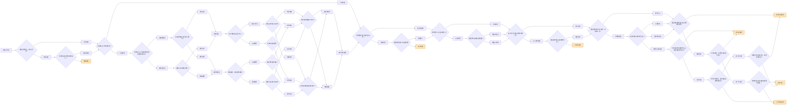

# 十二点零七码 首次交付流程图

按首次实际画布节点及边绘制，包含 Agent 内部自动返修；没有追加用户创作提示。

```mermaid
flowchart LR
  n1["雨夜行李票"]
  n2{"被站长扣票后，先怎么行动？"}
  n3["七座慢钟"]
  n4["夺票未成"]
  n5{"夺回票后是否仍信任顾临川？"}
  n6["迟来的坦白"]
  n7["带票离站"]
  n8{"如何确认乙四木箱仍在？"}
  n9["乙四木箱"]
  n10["先查库房"]
  n11{"暗查之后，先争取管理员还是截住转运车？"}
  n12["说服管理员"]
  n13["截住转运车"]
  n14{"是否把顾临川实名写入登记？"}
  n15{"顾临川如何拖住货物？"}
  n16["实名登记"]
  n17["匿名担保"]
  n18["依法扣货"]
  n19["制造故障"]
  n20["两册相合"]
  n21["共同的时限"]
  n22{"打开木箱后先保全什么？"}
  n23{"时限逼近，如何处理木箱？"}
  n24["先取原件"]
  n25["先读父亲信"]
  n26["记者保管"]
  n27["稽查保管"]
  n28{"名册交给谁保管？"}
  n29{"读信后如何保全证据？"}
  n30{"记者怎样留存信息？"}
  n31{"顾临川是否登记证据？"}
  n32["封回木箱"]
  n33["分散原件"]
  n34["只抄编号"]
  n35["抄录姓名"]
  n36["正式封存"]
  n37["暂不登记"]
  n38{"如何把木箱留在行李房？"}
  n39{"如何把分散证据带到暗门？"}
  n40["信任管理员"]
  n41["带箱转移"]
  n42["暗门后的证据"]
  n43{"韩世昌封住行李房后怎么办？"}
  n44["站长的条件"]
  n45["带证突围"]
  n46{"突围受阻后保人还是保箱？"}
  n47["舍箱保人"]
  n48["死守木箱"]
  n49{"找到地下入口后先做什么？"}
  n50["封站电话"]
  n51["先追木箱"]
  n52{"取回原件后由谁去通信室？"}
  n53["陆绮云送证"]
  n54["顾临川求援"]
  n55{"进入地下岔道后如何分配时间？"}
  n56["地下岔道"]
  n57["三人先修线路"]
  n58{"通信被切断后采用哪种办法？"}
  n59["重启总闸"]
  n60["寻找手摇机"]
  n61{"通信室停电而月台响铃，先救哪一边？"}
  n62["零号月台"]
  n63["回援通信室"]
  n64{"恢复线路后怎样赶去月台？"}
  n65["正面赶赴"]
  n66["沿电缆沟潜入"]
  n67["线路与人都保住"]
  n68{"是否接受韩世昌以安全换沉默的交易？"}
  n69{"父亲和基本证据都安全后，是否继续留下交证？"}
  n70["停驶信号"]
  n71["正式交证"]
  n72{"父亲获救后，是离开还是留下交证？"}
  n73{"案件已经重启，是否继续追查董事责任？"}
  n74["第一份证词"]
  n75["带父亲离开"]
  n76["第二封名单"]
  n77{"案件重启后是否继续追查董事责任？"}
  n78{"具备深层追责条件后，最终怎样结案？"}
  n79["止于重启案件"]
  n80["归还七码"]
  n81["接受午夜交易"]
  n1 --> n2
  n2 --> n3
  n2 --> n4
  n3 --> n8
  n4 --> n5
  n5 --> n6
  n5 --> n7
  n6 --> n8
  n8 --> n9
  n8 --> n10
  n9 --> n43
  n10 --> n11
  n11 --> n12
  n11 --> n13
  n12 --> n14
  n13 --> n15
  n14 --> n16
  n14 --> n17
  n15 --> n18
  n15 --> n19
  n16 --> n20
  n17 --> n21
  n18 --> n20
  n19 --> n21
  n20 --> n22
  n21 --> n23
  n22 --> n24
  n22 --> n25
  n23 --> n26
  n23 --> n27
  n24 --> n28
  n25 --> n29
  n26 --> n30
  n27 --> n31
  n28 --> n34
  n28 --> n35
  n29 --> n32
  n29 --> n33
  n30 --> n34
  n30 --> n35
  n31 --> n36
  n31 --> n37
  n32 --> n38
  n33 --> n39
  n34 --> n38
  n35 --> n39
  n36 --> n38
  n37 --> n39
  n38 --> n40
  n38 --> n41
  n39 --> n40
  n39 --> n41
  n40 --> n42
  n41 --> n42
  n42 --> n43
  n43 --> n44
  n43 --> n45
  n44 --> n49
  n45 --> n46
  n46 --> n47
  n46 --> n48
  n47 --> n49
  n49 --> n50
  n49 --> n51
  n50 --> n55
  n51 --> n52
  n52 --> n53
  n52 --> n54
  n53 --> n55
  n54 --> n55
  n55 --> n56
  n55 --> n57
  n56 --> n61
  n57 --> n58
  n58 --> n59
  n58 --> n60
  n59 --> n61
  n61 --> n62
  n61 --> n63
  n62 --> n68
  n63 --> n64
  n64 --> n65
  n64 --> n66
  n64 --> n67
  n65 --> n68
  n66 --> n68
  n67 --> n69
  n68 --> n70
  n68 --> n81
  n69 --> n75
  n69 --> n71
  n70 --> n72
  n71 --> n73
  n72 --> n74
  n72 --> n75
  n73 --> n79
  n73 --> n76
  n74 --> n77
  n76 --> n78
  n77 --> n80
  n77 --> n79
  n78 --> n80
  n78 --> n81
  style n7 fill:#ffe4b5,stroke:#b45309
  style n48 fill:#ffe4b5,stroke:#b45309
  style n60 fill:#ffe4b5,stroke:#b45309
  style n75 fill:#ffe4b5,stroke:#b45309
  style n79 fill:#ffe4b5,stroke:#b45309
  style n80 fill:#ffe4b5,stroke:#b45309
  style n81 fill:#ffe4b5,stroke:#b45309
```
