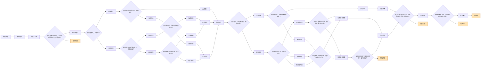

# 寄往黄泉的镖 首次交付流程图

按首次实际画布节点及边绘制，包含 Agent 内部自动返修；没有追加用户创作提示。

```mermaid
flowchart LR
  n1["雨夜接镖"]
  n2["雾岭截信"]
  n3["收信人已死"]
  n4{"确认顾晚舟已死后，怎么处理这封无法交付的信？"}
  n5["两个代收人"]
  n6["退回死信"]
  n7{"破庙遇袭时，先救谁？"}
  n8["破庙救人"]
  n9["林中擒口"]
  n10{"面对承认旧罪的师父，如何取证？"}
  n11{"抓到活口但鱼符被夺，下一步怎么做？"}
  n12["山庄故人"]
  n13["看押师父"]
  n14["审问活口"]
  n15["换回鱼符"]
  n16{"师父受控后，怎样取得地窖入口？"}
  n17{"顾青禾要求控制密函，怎么回应？"}
  n18["锁下合作"]
  n19["独查旧账"]
  n20["交信换路"]
  n21["破门取符"]
  n22["密道验符"]
  n23["正厅合符"]
  n24["地窖开信"]
  n25{"山庄起火、师父被困时，如何取舍？"}
  n26["火场救师"]
  n27["护账先撤"]
  n28{"账册受损后，走哪条路补强证据？"}
  n29{"师父被扣作人质，怎样处理？"}
  n30["山路寻证"]
  n31["官道抢渡"]
  n32["拒绝换师"]
  n33["以副本交易"]
  n34["陆青霜回救"]
  n35["渡口翻案"]
  n36{"人证或诱敌条件已具备，如何逼韩千城现身？"}
  n37{"已有官船或完整账册，选择哪种送证方式？"}
  n38["公开举证准备"]
  n39["秘密送证准备"]
  n40{"秘密送证后韩千城扣住同伴，如何收场？"}
  n41["渡口合围"]
  n42["焚账求生"]
  n43{"地方旧案已经能定罪，还要追仓船上的内应名册吗？"}
  n44["仓船追凶"]
  n45["渡口昭雪"]
  n46{"取得往来名册后，是否失去庇护亲赴京城？"}
  n47["赴京抉择"]
  n48["名册归公"]
  n49["新镖旗"]
  n1 --> n2
  n2 --> n3
  n3 --> n4
  n4 --> n5
  n4 --> n6
  n5 --> n7
  n7 --> n8
  n7 --> n9
  n8 --> n10
  n9 --> n11
  n10 --> n12
  n10 --> n13
  n11 --> n14
  n11 --> n15
  n12 --> n24
  n13 --> n16
  n14 --> n16
  n15 --> n17
  n16 --> n18
  n16 --> n19
  n17 --> n20
  n17 --> n21
  n18 --> n23
  n19 --> n22
  n20 --> n22
  n21 --> n23
  n22 --> n24
  n23 --> n24
  n24 --> n25
  n25 --> n26
  n25 --> n27
  n26 --> n28
  n27 --> n29
  n28 --> n30
  n28 --> n31
  n29 --> n32
  n29 --> n33
  n29 --> n34
  n30 --> n35
  n31 --> n37
  n32 --> n37
  n33 --> n36
  n34 --> n37
  n35 --> n43
  n36 --> n38
  n36 --> n39
  n37 --> n38
  n37 --> n39
  n38 --> n41
  n39 --> n40
  n40 --> n41
  n40 --> n42
  n41 --> n43
  n43 --> n44
  n43 --> n45
  n44 --> n46
  n46 --> n47
  n46 --> n48
  n47 --> n49
  style n6 fill:#ffe4b5,stroke:#b45309
  style n42 fill:#ffe4b5,stroke:#b45309
  style n45 fill:#ffe4b5,stroke:#b45309
  style n48 fill:#ffe4b5,stroke:#b45309
  style n49 fill:#ffe4b5,stroke:#b45309
```
