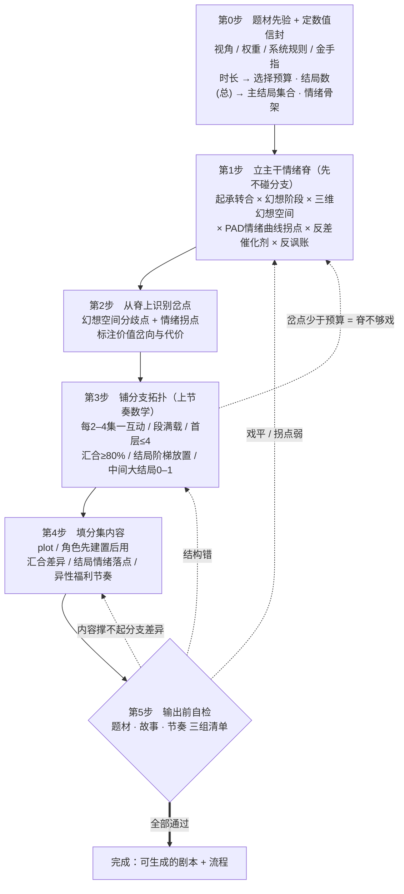

## 阅读说明

本规则书把互动影视游戏的设计经验整理成七个部分。前三部分是三层规则，第四部分是把它们落地成剧本的操作顺序，第五部分是自检清单，第六部分是关键口径说明，第七部分是剧本生成与制作约束（从大纲到分场剧本的落地规则）。

- **题材** 决定为用户生成的这个题材，够不够格称为一个产品；如果不够，缺在哪里。它先于故事。
- **故事** 决定"用什么内容去兑现题材对玩家许下的承诺"。
- **节奏** 决定"在时间轴上如何摆布情绪与选择"，让体验全程不无聊。
- **生成顺序** 决定"上面三层按什么先后落地成一个可生成的剧本和流程"。

书中凡是形象化的说法（如"情绪脊""编织带"），都紧跟一句直白解释和一句操作定义或量化口径。凡涉及数值，一律给精确区间、公式或阈值，区间都含两端。时间一律以分钟计，它是全书唯一的自由变量：以 60 分钟为核心基准，向下收缩就减少节点，向上扩张就增加节点。

---

## 术语总表

| 术语 | 含义 | 量化 / 操作定义 |
|---|---|---|
| 金手指 | 主角比普通人多出来的那点特殊本事 | 主角相对普通人独占的能力 / 身份 / 道具 / 信息，须限定使用规则与场景 |
| 幻想空间 | 玩家心里"这事接下来可能会怎样"的想象 | 一个带分支与分歧的可能性集合，每个可能性带一个实现概率 p∈[0,1] |
| 激励事件 | 打破平静、把剧情推向新方向的那件事 | 触发状态转移、开启新幻想空间的事件 |
| 情绪脊 | 主线上主角情绪从头到尾的主干走向，一条还没长出分支的曲线 | 主线路径上主角情绪坐标 P 随剧情推进的有序序列 |
| 认同开关 | 观众"这苦是主角的、这爽是我的"的心理切换 | 观众对主角情绪轨迹的选择性认同：负面剥离、正面认领 |
| PAD 三轴 | 用三根尺子量情绪：苦↔爽、平静↔激动、被压↔掌控 | 效价 V、唤醒 A、支配 D，每轴取值 −1 到 +1 |
| 情绪取向向量 | "只要我做这件事，我就会……"那股劲的方向和大小 | 向量 = P目标 − P当前；方向是取向，长度是动机强度 |
| 拐点 / 轴上反号 | 情绪突然掉头，比如从被压到翻盘、从得意到跌落 | 情绪轨迹方向突变；某一轴数值由负变正或由正变负 |
| 反差 | 现实给的结果和幻想的目标相反 | 反差 = P现实 − P目标；它会成为下一段的新起点（催化剂） |
| 岔点 | 剧情里"故事自己裂开、可以往不同方向走"的地方 | 幻想空间的分歧处 + 情绪拐点，是分支的候选位置 |
| 互动（interaction） | 一次需要玩家做的选择 | 一个带 2–4 个选项的选择节点 |
| 分支互动 | 会真正改变故事走向的那种选择 | 选项通向不同后续、从而改变分支树的互动（主要是决策性互动） |
| 汇合（bottleneck） | 几条岔路又并回同一条主路 | 某分支的下一步指向一个被两条及以上路径共享的后续节点 |
| 结局节点 | 故事的终点 | 没有任何后续的节点；分末段主结局 / 中间大结局 / 小结局(死路) 三种，三种都计入结局数 |
| 结局数（总） | 用户设定的结局总数 | ＝末段主结局 + 中间大结局 + 小结局(死路)；用户输入 1–10 或 AI 推荐，按 3.6 软区间分配到三种 |
| 末段主结局（主结局） | 核心体验的正式收场 | 剧情末段、体现价值分歧的终点结局；数量按题材定，一般 ≥2（≤10min / 纯爱 / 抽象可为 1） |
| 中间大结局（＝隐藏结局） | 提前兑现的一个完整好结局 | 起 / 承阶段带前置条件的隐藏岔口，2–4 节点（约 3 分钟）内走完"转+合"；全局 0–1 个 |
| 小结局 / 死路 | 选错即死的失败结局 | 中途失败收场，兼作中段情绪调剂 / 施压；计入结局数；"小结局"一词全书只指这种 |

---

# 第一部分　题材：这个题材够不够成为一个产品

## 1.1　视角的选择

先定义四个词：

- **POV（第一人称代入）**：镜头即主角的眼睛，玩家"就是"主角。
- **三视角（第三人称）**：镜头在主角之外观察，玩家"看着"主角经历故事。
- **美女 like**：以异性（通常为美女）陪伴与情感为核心卖点的产品；女性向的对应形态称为乙女。
- **非美女 like**：以事件、世界、玩法为核心卖点的产品。

选择规则（判断依据是"卖点核心落在情感还是落在故事"）：

| 产品类型 | 推荐视角 | 理由 |
|---|---|---|
| 纯情感 / 乙女 / 纯美女陪伴 | POV | 代入感最强，情感直接作用于玩家本人 |
| 故事 + 美女（两者都重） | 按具体题材权衡 | 需在代入与旁观之间取舍，无固定答案 |
| 纯故事产品 | 三视角 | 让玩家看清全局与人物关系，信息传达更完整 |

## 1.2　世界规则与金手指

- **游戏** = 玩家与一套"带规则的系统"进行交互。规则是游戏之所以为游戏的基本点。
- **系统规则**：这个世界里"什么可以做、什么会导致什么结果"的一套明确因果。
- **金手指**：主角相对普通人所拥有的特殊优势或特权。

四条规则：

1. 必须为每个产品提炼一套"高于玩家认知"的系统规则；否则会出现逻辑漏洞，以及"品类漂移"（产品在生成中跑偏成另一种题材）。
2. 博弈、智斗、权谋类题材自带被广泛共识的规则性（选对阵营、找对伙伴、避免死亡、成为老大、逃离危局），通常更容易做好。
3. 其余题材同样可做，但前提是系统先把规则梳理清楚，再生成故事。
4. 必须有金手指，并且必须明确限制它的"使用规则"和"使用场景"。不受限制的金手指会摧毁难度与代价，游戏随之失去张力。

## 1.3　题材想象空间：一份分阶段的幻想契约

**题材想象空间** = 题材对玩家许下的一份"分阶段幻想契约"，由两部分组成：

- **终极幻想目标**：玩家最终要达成的那个最大幻想。
- **中间阶段幻想**：通往终极目标途中，每一段可单独获得满足的幻想。

例（历史模拟器）：当上皇帝 → 争权夺位 → 掌握朝政 → 统一天下 → 平定叛乱 → 身后留名。

硬性构成规则：

1. 每个阶段必须同时提供两样东西：一个**强敌**，和一个**"可被克服"的难关**。
2. 承诺：只要玩家正确游玩，就一定能达成，绝不违反玩家对这一题材的预期。
3. 题材划定后，它的"想象空间阶段清单"作为已知输入交给后续的故事生成。

> **重要区分**：题材层的"达成"是**保证**，不是悬念。真正允许失败、需要拉扯的悬念，留给故事层的**情感线**（见 2.5）。事业维度保证兑现，情感维度可成可败——两者分工明确，并不矛盾。

## 1.4　类型融合与破局

有的题材天生吸引力不足（例如"校园恋爱"这类：想象空间小、没有强敌、代价低、结局可预测）。1.1 的先验一旦判定"不够格成为产品"，破局的办法就是**类型融合**。

先说怎么"感知"细分题材：题材千千万还能相互融合，**不要去套一张固定的分类表**，而是对任何输入（哪怕只有"做一个修仙游戏"这么粗）当场生成它的**题材画像**——核心幻想、阶段幻想清单、天然强敌、可克服的难关、核心爽点类型。画像一生成，够不够格、缺什么，就都看出来了。

融合按四步走：

1. **诊断缺口**：看画像缺哪一项，多数弱题材缺的是"强敌 / 高代价 / 规则张力"。
2. **按缺口选一个"供能类型"融进来**：缺强敌 / 规则 → 融悬疑、推理、规则怪谈；缺生死 / 高代价 → 融时间循环、生存、惊悚；缺幻想尺度 / 爽点 → 融异能、超自然、异世界。
3. **底色不动，惊喜靠反差**：用户点名的类型当**情感底色**（兑现他的预期），融进来的类型当**张力引擎**（给预期之外的惊喜）。惊喜的产生方式，就是把融合做成**开场后的反差催化剂**（2.5 那条规则升到题材级）——先给一段纯的原类型兑现预期，再用一个激励事件翻入第二类型。
4. **融合后重跑 1.1 与 2.7**：现在有强敌和可克服的难关了吗？一句话定位的四要素齐了吗？（例："校园恋爱 + 时间循环"——你暗恋的女孩在放学那天出事，你却被困在这一天里反复重来，想和她在一起，得先查清那天到底发生了什么。四要素齐、惊喜也出来了。）

**优先级（主次）**：用户点名的类型是**底色（主）**，它的核心承诺必须兑现；融进来的供能类型是**惊喜（次）**，只增益，不能喧宾夺主到让玩家觉得"这不是我点的那类东西"。

---

# 第二部分　故事：用什么内容兑现契约

## 2.1　三个维度与它们的权重

把一条故事拆成三条同时推进的线：

- **情感维度**：主角与异性角色的关系。幻想空间 = 这段关系的"进步"。
- **事业维度**：主角与"当前要达成目标"的关系。幻想空间 = 达成目标的可能路径，以及达成后的获得感。
- **情绪维度**：**主角**当下真实体验到的情绪（注意：追踪的是主角，不是玩家；玩家与主角的关系见 2.3）。幻想空间 = 完成这件事带来的情绪反馈。

权重规则（称为"让位关系"）：

- 情感与事业的相对权重**由题材决定**：恋爱类题材以情感为主，非恋爱类以事业为主。这是一根连续可调的权重，不是"每段都均分"的硬格子。
- 情绪维度不是与前两者并列的独立输入，而是它们的**因变量**：由情感事件与事业事件叠加后读出，因此在任何时刻都必然存在，是持续供给的即时反馈。

## 2.2　幻想空间如何生成

**幻想空间** = 玩家对"这件事接下来可能怎样"的想象，天然带分支与分歧，因人而异。

- 三个维度分别在**起、承、转、合**四阶段，各自通过**激励事件**撑开新的幻想空间。
- 三个维度的幻想空间之间，必须能形成一条"**自发逻辑链**"：玩家仅凭生活经验就能自行把它们脑补串联，无需额外解释。
- 每个幻想空间都带一个**实现概率 p**，取值 0 到 1，等于该事件在现实逻辑下真正能达成的可能性。p 与玩家"有多想要"无关——玩家可以极度渴望一件低概率的事。这一落差是戏剧反讽的来源。

## 2.3　观众主体性与戏剧反讽：认同开关

前提：在互动影视里，玩家（观众）与主角**不是同一个情绪主体**。全书只追踪一条情绪轨迹，即主角的那条。玩家通过一个"**认同开关**"贴着这条轨迹体验：

- **负面拍点（主角受委屈、被压制）→ 剥离**：玩家心里说"受委屈的是主角，不是我"，拒绝坐进被羞辱的位置，始终保持自己是主体。
- **爽点（主角翻盘）→ 认领**：玩家心里说"这个爽是我的"；而且正因为是玩家的选择促成，认领才成立。

由此得到**戏剧反讽**：主角获得的东西里，潜藏着他没察觉、而观众看得到的风险。因为苦不落在自己身上，观众能同时"希望主角赢"和"期待赢之后风险被触发"，把风险当享受而非恐惧。

三条硬性设计规则：

1. 负面拍点必须"**可剥离**"：不能让玩家被迫吞下屈辱，否则玩家跟着憋屈、失去爽感。
2. 爽点必须"**可认领，且由玩家的选择促成**"：翻盘若不是玩家选出来的，就变成"与我无关"。
3. 落实反讽的方法：每撑开一个幻想空间，就同时登记一条"**观众已知、主角未知的风险**"。不登记，反讽写不出来，画面上只剩平淡的正面获得。

> **说明（视角与认同开关）**：认同开关在 POV 与三视角下**都成立**。POV 会强化"认领"，但"剥离"依然发生——玩家把屈辱判给"那个角色"，而不是自己愿意代入的那个胜利者身份。

## 2.4　情绪的量化坐标：PAD 向量模型

目的：把"当下情绪"和"内在情绪取向"从含糊的形容词，变成可以计算的坐标，用来画情绪曲线、判断一场戏的戏剧强度。

三个坐标轴，每轴取值 −1 到 +1：

- **V　效价（愉悦度）**：−1 极苦，+1 极爽。
- **A　唤醒度（激活度）**：−1 极平静，+1 极激动。
- **D　支配度（掌控度）**：−1 完全受制、被压，+1 完全掌控、占上风。

**为什么必须有第三轴 D**：只有 V、A 两轴时，"愤怒"和"恐惧"分不开（都是负效价、高唤醒），但愤怒指向进攻、恐惧指向逃跑。而互动影视的核心驱动"受了委屈就想反击、要在精神上压过对方"，这里的"压过"正是支配度的移动，前两轴表达不了。加上 D 轴即为心理学成熟的 PAD 模型，本就是罗素情绪原型的三维扩展。

在这套坐标里：

- **情绪状态 = 一个坐标点 P =（V, A, D）**。
- **内在情绪取向 = 向量 = P目标 − P当前**。"只要我做了某件事，我就会……"这句话，就是指定了目标坐标 P目标；"做的这件事"是把自己从当前推向目标的动作。向量方向 = 情绪取向（"反击"是从"委屈"指向"扬眉吐气"的方向，反击本身不是情绪，是这根向量），向量长度 = 动机强度：目标离当前越远，动机越强。
- **反差 = P现实 − P目标**：现实把主角送到的真实坐标与幻想目标之差。当这个差在 D 轴或 V 轴上"反号"（幻想是掌控、现实被压；幻想是爽、现实是苦），反差最强。这个反差向量成为下一段的新起点，即上一段的结果反过来当下一段的催化剂。
- **情绪曲线 = 情绪点 P 沿起承转合走出的轨迹**。"拐点"就是轨迹方向的突变，最有戏剧性的是"轴上反号"：D 从负翻正是被压制到翻盘，V 从正翻负是得意到跌落。强戏 = 大幅、反号的拐；平戏 = 小幅、同向的漂移。

用一个具体例子把坐标钉死（校园逆袭：主角被数学好的情敌打压，想靠奥数获奖赢得心仪女生的注意）：

| 情绪点 | V | A | D | 说明 |
|---|---|---|---|---|
| 委屈·被打压（当前） | −0.6 | +0.2 | −0.7 | 起点：苦、被压制 |
| 扬眉吐气·压过对方（目标） | +0.8 | +0.7 | +0.8 | 幻想的终点：爽、掌控 |
| 现实：她其实不喜欢你 | −0.4 | +0.5 | −0.5 | 现实落点，与目标相反 |

由表可算：情绪取向向量 = 目标 − 当前 = (+1.4, +0.5, +1.5)，方向指向更爽、更激动、更掌控，长度大，动机很强。反差 = 现实 − 目标 = (−1.2, −0.2, −1.3)，V 与 D 双双反号，是一次强反差，足以成为下一段催化剂。

## 2.5　催化剂与反套路：结果的硬规则

1. 结果必须同时包含"追求成功"和"追求不成功"两种可能。此规则针对**情感维度**这类真分支；事业维度的题材目标仍遵守 1.3 的保证，不在此列。
2. 成功的可能性**不能来自"名义事件"本身**，而必须来自名义事件过程中触发的**连锁反应**。例如：不是"因为赢了奥数所以女生喜欢你"，而是备赛过程里发生的一连串事件改变了两人关系。
3. 做法口诀：先认真地铺陈，再让结果与幻想产生**反差**，然后用这个反差作为下一段的催化剂。
4. 主动规避老套：不要用"街头挑衅的男生""电瓶车撞人"这类草率、雷同的桥段硬凑首个矛盾。首个矛盾必须由上面的连锁反应加反差生成，而不是临时抓一个意外事件顶上。

## 2.6　恋爱 + 题材产品的情感节奏：异性角色的配置

异性角色数量（量化）：

- 传统互动影视（约 6 小时体量）：2 到 5 名异性角色，可在剧情中完成成长。
- 更短的产品（约 1 小时体量）：建议 2 到 3 名，其中通常含 1 名纯功能性角色；1 小时最多容纳 3 名，能把 2 名写透就已经很好。
- 原因：受拍摄成本与观众记忆容量限制，角色过多会稀释情感、也记不住。

出场节奏（规则）：

- 不要一上来就同屏抛出多个异性角色让玩家挑选——这会立刻拉低玩家对整个产品情感调性的期待阈值，显得格调低、没有惊喜。
- 正确做法：每隔一段时间登场一名异性，在当前这名异性的单元里把她（他）的故事讲透；到后续某个剧情节点，再把此前出现过的异性形象集中汇总，给玩家一个"**福利**"节点，让玩家从中选择一位。

福利的形态按性别向不同：

| 性别向 | 福利形态 | 作用 |
|---|---|---|
| 男性向 | 被选中的异性产出一部分"可消费的擦边内容" | 直接兑现，作为情感投入的回报 |
| 女性向 | 换成"情绪价值的私密节点"，如得知对方不为人知的秘密、两人共享一段独有记忆 | 在后续成为伏笔、形成回环，产出差异化的可消费情绪价值 |

男女玩家期待差异与共同点：

- **男性玩家**：更在意擦边内容够不够有料、有没有情感关心或数值成长；表达要更直白。
- **女性玩家**：期待更细腻，希望戳中心思、差异化、不油腻，"不明说也能 get"。
- **共同点**：无论男女，都期待"选择之后有后续爆发"——选择不能选完就没了下文。

## 2.7　一句话定位（logline）

一句话定位，是用一句话把整部作品的核心卖点说清楚，让人一听就想看。它不是可有可无的宣传语，而是一次**强制的压缩自检**：一句合格的定位必须同时装下四样东西，而这四样正好是本框架三层各自的核心产出——写得出来，说明四台引擎都点着了；写不出来，说明其中某一层还缺东西。

四要素（括号内是它在框架里的来源）：

- **期待**（来自题材想象空间，1.3）：它许诺了什么幻想，让人知道能得到什么。
- **反转**（来自反差 / 催化剂，2.4、2.5）：有一个反预期的扭力，让人觉得不落俗套。
- **钩子**（来自结尾钩子 / 悬念，3.5、3.6）：留一个未解的悬念或诱因，让人想往下看。
- **情绪**（来自 PAD 情绪坐标，2.4）：定下一个明确的情绪基调，让人先有感觉。

用法：在正式生成前先写出这一句（对应生成顺序第 0 步）。四要素缺一，就回到对应那一层补齐；这一句写顺了，整部的卖点、扭力、悬念和情绪基调也就都立住了。

## 2.8　单点情节的题材透镜：平情节禁令

2.5 的"铺陈→反差→催化剂"是结构规则，1.4 的类型融合是题材规则。本节把两者下沉到**单点情节**：每一个具体情节，都必须过一遍"题材透镜"，产出该题材下独有的反差物与钩子。这直接决定故事的精彩程度。

**平情节的定义（禁止项）**：一个情节如果只有"事件＋普通人反应"、没有题材独有的反差物、后续收口只是常识性解决，就是平情节。平情节允许作为铺陈存在，但**不允许作为一个节点的落点**。

**操作步骤（对每个关键情节执行）**：

1. **落地一件具体的事**：写实、可信、贴自然逻辑（例：我去买早餐，买了包子，发现包子坏了）。
2. **过题材透镜换反差物**：同一情节骨架，反差物必须由当前题材（含融合题材）决定——反差物是题材的信物，不是随机的惊吓：
   - 现实：包子坏了，我没和老板说。（这是平情节，只能当铺陈，不能是落点）
   - ＋恐怖：馅里的肉可能是人肉，依稀可见一块指甲——所以我没和老板说。
   - ＋修仙：馅里有一颗金丹。
   - ＋修仙＋都市奇幻：金丹能点石成金——我没和老板说，因为我知道我有花不完的钱。
3. **收口必须在同一题材逻辑内升级，禁止常识性收口**：后续兑现要沿着题材的世界规则往上走，不能回落成现实常识解决：
   - 现实收口（平，禁止作为落点）：第二天老板主动补了钱。
   - 恐怖收口（合格）：第二天老板看我的眼神变了，多给我一个包子："晚上十二点吃，效果更好。"——**钩子双义**：你不知道他是要帮你还是害你。
   - 修仙收口（合格）：金丹助我腾云驾雾，空中遇到另一个飞的人，他带我进了修仙世界——原来这个世界真的有修仙。
   - 修仙奇幻收口（合格）：点石成金让我成了黄金富豪，城里最强大盗点名要偷我的金子、杀我全家——我可以选：跟他干（我有的是钱和保安），还是保持低调、归还能力。（反差物直接长成了抉择点）
4. **钩子即催化剂的口子**：每个收口留下的钩子，就是下一段反差催化剂的入口（2.5）；最强的钩子是双义钩子（福祸未知、帮害难辨）。

**质检口径**：逐个检查关键节点——反差物是否题材独有（换个题材这个反差物就不成立，才算独有）；收口是否升级而非常识解决；钩子是否为下一段留了口子。三问有一问不过，该节点回炉。

**与其他规则的关系**：本节是 1.4（题材融合）× 2.5（反差催化剂）在节点粒度上的乘积；融合题材时，反差物优先从"供能类型"里取（1.4 的张力引擎），底色题材负责情节骨架的可信落地。

## 2.9　力度谱：压制与释放的强度口径（校准中）

2.4 说"强戏＝大幅反号的拐"，本节给"多大幅算够"的数值基准。情绪曲线定的是**拍位**（压制与释放各落在哪一拍）；力度谱定的是**振幅**（压制多深、释放多强）。本节数值是 v1 初始基准，靠人工逐拍评价持续校准（见校准循环）。

**三个操作量**：

- **压制深度**＝负面拍的 V 值（越低越强），叠加 D 值（支配度越低压制越彻底）。
- **释放高度**＝正面拍的 V 值。
- **落差**＝释放拍 V − 此前最近谷底 V。**释放的强度主要看落差，不看绝对高度**——先压得深，释放才有力（2.5 铺陈→反差的振幅表达）。

**v1 基准（60 分钟情绪弧；短片按同比例）**：

| 拍位 | 力度口径 |
|---|---|
| 开场压制 | V ∈ [−0.6, −0.35]，D ≤ −0.5：压制要充分且可剥离（2.3）；V > −0.3 属压制不足 |
| 首个释放点 | 落差 ≥ 0.7，V ≥ +0.4：先兑现一次，不必最强 |
| 中段最强压制（转段跌落） | V ≤ −0.6 且相对前峰落差 ≥ 1.0，V 或 D 必须反号：全篇压制最深处 |
| 高潮释放 | V ≥ +0.8，相对谷底落差 ≥ 1.4，且 D 同步翻正（高潮＝翻盘，不只是愉悦） |
| 收尾余韵 | V ∈ [+0.2, +0.5]：从高点回落收束，保留余味 |

**两条禁令**：

1. **连续同向禁令**：连续 2 拍以上同方向小幅漂移（|ΔV| < 0.15）＝无有效压制或释放，平戏过长。
2. **释放贬值禁令**：两个释放拍（V > +0.4）之间必须有一次 V ≤ −0.2 的回落，否则后一个释放的体感强度必然下降。

**校准循环（本节的维护方式）**：每次生成后，人工对每一拍评「不足 / 合适 / 过度」；评价累积成校准数据，按题材×拍位统计后回写本表。本表是活的：数值以最新校准为准。

---

# 第三部分　节奏：如何在时间轴上摆布情绪与选择

本层唯一自由变量是时间（分钟）。**用这一部分，按三步走：**

1. **定时长。** 用户 / 产品给了目标时长就直接用（指定优先）；没给、或要做节奏自检，就用 3.1.4 的"时长推荐"得出一个区间。
2. **时长选引擎（双引擎）。** 时长决定用哪台引擎，两者卖点不同：
   - **短片（≤ 约 30 分钟）→ 结局树引擎**（见 3.1.3）：卖点是分岔到不同结局、鼓励复玩。
   - **长片（≥ 约 45 分钟）→ 情绪弧引擎**（见 3.1 与 3.1.1）：卖点是情绪沿起承转合累积、沉浸。
   - **30–45 分钟 = 过渡枢纽**：一个完整七拍的标准章。
3. **按所选引擎套结构，再走 3.2–3.6 的选择与分支规则。** 其中 **3.1（七拍）、3.4（四段分配）、3.6 的"阶梯式放置"只对长片**；短片一律以 3.1.3 的结局树为准。

后面所有数量都随时间同比缩放。

## 3.1　章节情绪弧：30 到 45 分钟

> **适用范围**：本节（3.1 与 3.1.1）是**长片的情绪弧引擎**，用于 30 分钟以上。短片（≤ 约 30 分钟）不套七拍，走 3.1.3 的结局树。

**章节情绪弧** = 一章（约 30 到 45 分钟的一个体验单元）内，**玩家（观众）**应依次体验到的情绪序列。

规则是一条七拍序列，按顺序发生：

> 紧张开场 → 惊奇探索 → 好奇（对某件事产生疑问）→ 进行探索 → 获得成就（对抗并战胜强敌）→ 章节高潮 → 震撼收尾。

- 目的：让玩家全程保持对故事的关注力，不出现无聊段落，并持续强调玩家作为主体的体验。
- 说明：这是一种经过验证的可行序列，不是唯一解；任何替代方案都必须守住"无聊点为零"这一底线。

> **说明（两条情绪线的关系）**：本节的"情绪弧"是**观众端的体验目标**（是"果"）；2.4 的 PAD 曲线是**主角内部的情绪坐标**（是"因"）；2.3 的认同开关是把"因"传导成"果"的机制。三者是一条因果链：主角在坐标上翻盘（因）→ 经认同开关被玩家认领（机制）→ 玩家体验到"获得成就 / 章节高潮"（果）。

### 3.1.1　时长分档与双引擎

时长决定用哪台引擎，也决定结构长什么样（下表阈值可按 3.1.4 与真实数据校准）：

| 时长 | 引擎 | 结构 | 抉择数 |
|---|---|---|---|
| ≤ 10 分钟 | 结局树（极简） | 装置 → 一次兑现一记反转 → 1–2 抉择 → 2–3 结局（见 3.1.3） | 1–2 |
| 10–30 分钟 | 结局树 | 装置 → 兑现反转 → 2–3 抉择树 → 3–4 结局（见 3.1.3） | 2–3 |
| 30–45 分钟 | 情绪弧·标准章（过渡枢纽） | 一个完整七拍（3.1），可含 1–2 抉择 | 按 3.2 缩放 |
| 45 分钟–2.5 小时 | 情绪弧·多章串联 | 若干完整七拍章，串在一个或几个幕里 | 累加 |
| 3 小时及以上 | 情绪弧·长篇嵌套 | 顶层四幕完整起承转合，每幕含多章 | 累加 |

**10 分钟是一条硬线**：短于它，只给 1–2 次抉择、2–3 个结局，是最精简的结局树，别硬塞七拍。（这条线与 3.4"时长 ≤ 10 分钟才允许某段选择为 0"是同一条界。）

**长片的递归不变量**（只对情绪弧引擎，即 30 分钟以上。四级单元由小到大：拍 < 章 < 幕 < 整部）：

> **凡是跨越多个章的层级——每一个幕，乃至整部——它本身也必须构成一条完整的小情绪弧：有自己的铺垫、激励、升级、局部高潮，以及通向下一层的收尾钩子。**

这条规则防止一部数小时的长篇"只有一个大高潮、其余全是平的填充"。用 PAD 来说：最大的那几个拐点（轴上反号）留给顶层的转与合；而每一个幕、每一个章，都要有自己量级的拐点和高潮，让玩家在每一个尺度上都被抓住。

### 3.1.2　开场前五分钟：一个强制交互点

前五分钟必须出现一个交互点（短片、长片都适用）。它同时承担三件事：教学（让玩家学会"这里可以做选择"）、让玩家在开场就带入一份情绪、以及完成一个明确的戏剧功能。

- 它通常**不制造真正的剧情分支**：要么几个选项最后都汇回同一条主线，要么其中的"错误"选项是一个明摆着的教学死路（选了当场就死，然后回到正轨）。它的价值在教学和情绪代入，不在分支。
- 但它**不能随手摆在开头**，必须落在**第一个情节点的高潮处**——先让玩家感受到一股情绪，再让他借这股情绪做出这个选择。
- 好的开场交互点往往一举多得。例（谍战）：前五分钟给一个"现在就去刺杀那位日本高官"的选项，选了必死。它一口气解决三件事——先让玩家尝到代价，再让玩家体会到主角必须忍辱负重，最后"当场就死"本身又成了一个喜剧点（毕竟只有傻子才会现在就动手）。例（科幻）：前五分钟连问两个问题——你叫什么、你是谁——让玩家一上来就在这个科幻世界里给自己定好位；这一问一答本身就是那个教学交互点。
- 底线：无论具体怎么设计，这个交互点都要完成一个戏剧功能，并让主角（玩家）产生一份可带入的情绪。

### 3.1.3　短片：结局树结构（≤ 约 30 分钟的引擎）

短片撑不起七拍情绪弧，它的"游戏性"来自**分岔到不同结局、让人想重玩**。所以短片不按情绪弧组织，而按**结局树**组织。它有五个部件（这是十分钟级短片反复验证出的骨架）：

1. **装置先行**（前约 15%）：极速立起世界 + 一个核心装置（金手指 / 系统规则 / 结构镜像）+ 一份代价或威胁的暗示。不铺暖场。
2. **一次兑现 + 一记反转**：先让玩家尝到装置带来的幻想（如"心愿成真的蜜月""受气后翻身"），紧接着翻出代价（就是压缩版的反差催化剂，2.5）。这是短片唯一的情绪引擎。
3. **抉择树（1–3 个抉择点）**：短片里抉择更重，几乎每个都改结局——因为没有长度去消化"选了没差别"。
4. **多结局分岔（2–4 个）**：这是短片的核心卖点。每个结局一个鲜明的价值 / 情绪落点。
5. **前五分钟教学交互仍适用**（与 3.1.2 不冲突：那个交互点通常就是抉择树的第一个）。

短片分支有两种模式，都合法：

- **真多结局**：换选择 = 换结局，玩家复玩去看别的收场。例如一个恐怖短片，主角在不同抉择下分别走向"沉溺""毁灭""解脱"三种收场。
- **改情绪底色、汇合共同结尾**：结局只有一个，但走哪条分支决定它的情绪底色。例如同一个悲剧收场，"出手救"与"冷眼不管"两条分支，把它分别染成揪心与赎罪两种味道。

短片同样服从题材（装置 = 金手指）、反差催化剂（2.5）、结局三层（3.6）与一句话定位（2.7）；变的只是"组织方式是结局树，不是情绪弧"。

### 3.1.4　时长的推荐与节奏自检

时长优先用给定值。没给、或写完故事要做节奏自检时，用下面的方法推荐一个区间。

**五个驱动因子**（把时长往短推 ←→ 往长推）：

- 情绪基调：高唤醒的负向情绪（恐惧、紧张）不可持续 → 短；温暖、热血、沉浸 → 长。
- 世界观负载：轻（校园、都市）→ 短；重（玄幻、权谋、科幻、国漫史诗）→ 长。
- 角色广度：单线、双人 → 短；群像、多线 → 长。
- 爽点结构：单一反转、惊吓 → 短；累积成长、养成、逆袭 → 长。
- 信息密度：偏高 → 适度拉长（要留消化时间），但过载会疲劳。

**锚点区间**（参考值，靠数据持续校准，不是死表）：

| 倾向 | 典型区间 | 什么把它推到这 | 举例 |
|---|---|---|---|
| 强短 | 30–45 分钟 | 高唤醒负向不可持续、单一反转、轻世界观 | 恐怖、单一悬案 |
| 中 | 45–90 分钟 | 双人 / 单线、日常世界观、情感为主 | 校园 / 都市恋爱、职场、轻悬疑 |
| 长 | 90–180+ 分钟 | 重世界观、群像多线、累积成长、史诗沉浸 | 权谋、修仙玄幻、群像、国漫、多线乙女 |

（上表偏"完整情绪弧作品"的时长；若产品定位就是十分钟级短片，直接落到 3.1.1 分档表的短片档，用结局树。）

**节奏自检**：写完故事后，拿三个值比对——① 驱动因子给的先验区间 ② 你故事实际结构撑起来的自然长度 ③ 数据锚点（同类网络产品均值、平台与受众预期）。三者不符就动手：太长砍支线、合并；太短加幕或换更长的融合类型；或直接改目标时长。时长一旦变了，回第 1 步（3.1.1）重新定引擎与分档。

## 3.2　选择的总量

- 规则：1 小时的体验中，出现约 **18 到 25 次**（经验中位数约 20 次）抉择或交互。**这里数的是三类选择的总数**（决策性 + 情感类 + 调剂类）。
- 性质说明：这个数值来自多款产品的实践积累，是经验节奏而非理论推导；它随总时长同比缩放（见 3.4）。
- **短片例外**：≤ 约 30 分钟的短片，抉择数以 3.1.3 结局树为准（1–3 个），不必套 18–25。

## 3.3　三种互动类型

互动不只有"做决策"一种。按"对剧情和情绪是否有真实影响"分为三类：

**（1）决策性互动**

- 定义：对后续剧情或个人情绪有强烈影响的选择。包括：大分支、道德困境、数值结构变化、选错即死。
- 分布规则：属于较"重"的互动，一章内不宜过多，通常集中在章节高潮部分；做多了会造成玩家负担。
- 说明：这类互动是**分支互动**的主要来源（会改变分支树）。

**（2）情感类互动**

- 定义：与异性或其他人物的言行交互，影响对方好感度与看法，或影响主角自己的情感心态（我要亲近谁）、对对方的人设判断（他是好是坏）、以及对方对主角的判断（前端常表现为好感度数值）。
- 硬规则：无论交互大小，必须让当下人物的情感产生**链接和改变**——变好或变坏都行，但必须有变化、有结果。结果最好可量化（如好感度数值），或体现为"有人记住了你的选择"这类对未来的明确影响。

**（3）调剂类互动**

- 定义：为让体验舒服、或用于引导教学而设置的、对剧情和情绪**没有真实影响**的选择，即"**安全选项**"，用于塑造规则、塑造人物或交代世界观。
- 反直觉的用法：在连续几个安全选项中间，突然嵌入一个真正的情感类或决策性互动，会让游戏性产生质的提升——因为玩家在放松警惕后被真选择击中。
- 做法要求：调剂类互动的每个选项也要给出**不同的即时结果**（岔出一小段不同的戏 / 一句不同的反馈 / 被人记住），再合流回主线；**不要做"两个选项直接指向同一节点、零差异"的空合流假选项**——那是"选了等于没选"，应尽量少做，宁可改成纯剧情。

## 3.4　选择在起承转合四段的分配：数量模型

> **适用范围**：本节只对长片（情绪弧引擎，30 分钟以上）。短片的抉择不按四段分配，按 3.1.3 的结局树。

**满载上限**指"当目标时长 = 60 分钟时，每段的分支互动数量上限"。

| 阶段 | 满载上限（60 分钟） | 阶段 | 满载上限（60 分钟） |
|---|---|---|---|
| 起 | ≤ 5 | 转 | ≤ 5 |
| 承 | ≤ 6 | 合 | ≤ 2 |

满载合计 = 5 + 6 + 5 + 2 = **18**。在此基础上：

1. **随时长缩放**：某段上限 = round(该段满载值 × 目标时长 ÷ 60)。即 30 分钟约为一半，120 分钟约为翻倍，超过 60 分钟继续按比例放大。
2. **每段实际取值**：在"下限～上限"之间取一个值，不要每次取满、也不要固定，使同样的输入每次生成都有结构差异。
3. **下限规则**：目标时长大于 10 分钟时，每段至少 1 个（基本不出现空段）；只有小于等于 10 分钟时才允许某段为 0，此时整部可能只有两三个选择。
4. **全局下限**：整部作品的互动总数不少于 2。

> **说明（三个节奏口径的关系）**：本节的"满载 18"数的是**分支互动**（改变分支树的那种），它是 3.2"总数 18–25"的一个**子集**（另有情感类、调剂类不改变分支树，补足到 25）。当"每 2–4 集一个互动"（3.5 的节奏）与"满载"发生冲突时，**优先级是：段满载（硬上限）> 每 2–4 集（平均目标）> 总量经验值**。三者在约 18–20 处收敛，彼此一致。

## 3.5　分支结构：编织带模型

**核心比喻**：分支像一条"**编织带**"，不是无限分叉的树。主线宽度始终可控，永远不会炸开。（直白说：几股线拧在一起、时分时合，但整体还是一条带子。）

术语（详见术语总表）：

- **互动**：带 2–4 个选项的选择节点。
- **汇合（bottleneck）**：某分支的下一步指向一个被两条及以上路径共享的后续节点。
- **第 N 层互动**：沿任一路径，从开头起遇到的第 N 个互动；"第二层及更深"指层级 ≥ 2。
- **结局节点**：故事的终点，没有任何后续。会再次分流的节点是互动，不是结局节点。结局节点分主结局与小结局两类。

四组规则：

- **节奏**：沿任一路径，平均每 2 到 4 集出现 1 个互动；硬上限是任一路径上连续不含互动的集数 ≤ 4。
- **选项**：每个互动给 2 到 4 个选项（推荐 2 到 3）；每个选项必须具备"明确代价"或"实质后果差异"之一；禁止**伪决策**，即不得存在某一选项明显更优、其余纯送死的情形。**同时要少做"空合流"假选项**：即两个（或多个）选项直接汇入同一个后续节点、彼此毫无差异（"选了等于没选"）。合流本身没问题——编织带就是要时分时合——但必须**带差异地合流**：每个选项先各自产生一个不同的即时结果（岔出一小段不同的戏 / 一句不同的反馈 / "有人记住了你的选择"），再并回主线。做不到差异，就不如省掉这个选项、改成纯剧情推进。
  - **与 3.3 的衔接**：这里"禁止安全选项"只针对**决策性与情感类**互动；3.3 的**调剂类**安全选项是另一种、有意为之的类型。判断办法：这个选项是否被设计为"对剧情情绪无真实影响"，是则属调剂类，允许；否则属决策类，禁止其成为伪选项。**但即便是允许的调剂类，也遵守上面的"带差异地合流"——调剂类给的是"不同的即时反馈后再合流"，不是"两选项指向同一节点、零差异"。**
- **宽度**：第一层互动最多分出 4 条分支。
- **收敛**：第二层及更深的分支里，**要继续往下走的那些**，绝大多数必须汇合回共享后续——**汇合 ≥ 80%**（目标约 85%）。这条只约束"继续分支"，作用是防主线炸开。**小结局（死路）不进这个分母**：它的数量由 3.6 的结局分配表按总结局数定，是单列预算，不是深层分支的百分比。两条护栏：小结局必须**均匀铺开、不扎堆**（按分配数摊到中段各处）；**同一个互动的选项不能全是死路**，至少留一条活路继续。

## 3.6　结局体系：三层分类、计数与放置

三种结局都是"结局"，功能不同，但**三种都计入结局数**：

- **末段主结局（主结局）**：走到剧情最后、体现价值分歧的核心体验收场，是玩家真正要玩到的正式结局。
- **中间大结局（＝隐藏结局）**：一个提前放在起 / 承阶段的完整好结局，往往带前置条件、以隐藏结局形式触发，选中后在 2 到 4 个节点（约 3 分钟）内快速走完"转+合"、把一条替代人生讲圆满。它是"大家心里那个最好的结局"，被提前兑现。全局 0 或 1 个，只在有这种早期隐藏岔口的机会时才做。
  - 范例（名利游戏）：主角追名逐利会牺牲大学女友；但若他早早"珍惜眼前人"，就在起 / 承的一个弧光转折点岔出——不追逐、退居幕后捧红女友，自己当居家男人，两人得一个圆满感情结局，约 3 分钟讲完转合。这就是一个中间大结局 / 隐藏结局。
- **小结局（死路）**：选错即死、无法继续推进的失败收场。它不只是"质感层"，更是**中段的情绪调剂 / 施压手段**——用"走错就没了"给玩家真实压力。**全书"小结局"一词只指这一种。**

**结局数（总）= 末段主结局 + 中间大结局 + 小结局（死路）。三种全部计入。** 用户输入的"结局数"就是这个总数（1–10，或 AI 推荐）。

计数与分配规则：

1. **用户设定的结局数 = 三种结局之和**（总数，1–10）。N = 1 就是只有一个主结局的单结局。
2. **先定主结局、再铺小结局**：先按题材 / 故事分析想清"核心体验有哪几种收场"（主结局），再拿小结局铺中段压力；中间大结局只在有隐藏岔口机会时加。
3. **分配软区间**（模型在区间内按题材浮动取值，N = 总结局数）：

| 总数 N | 主结局 | 中间大结局 | 小结局 / 死路 |
|---|---|---|---|
| 1 | 1 | 0 | 0 |
| 2 | 2 | 0 | 0 |
| 3 | 2 | 0–1 | 0–1 |
| 4 | 2 | 0–1 | 1–2 |
| 5 | 2–3 | 0–1 | 2–3 |
| 6 | 2–3 | 0–1 | 2–3 |
| 7 | 3 | 0–1 | 3–4 |
| 8 | 3 | 0–1 | 4–5 |
| 9 | 3–4 | 0–1 | 4–6 |
| 10 | 3–4 | 0–1 | 5–7 |

4. **主结局数（题材驱动）**：下限 2（N = 1、或 ≤10 分钟的纯爱 / 抽象可为 1）；一般上限 4。例外：多女主按"每人一个 + 可含'都不选'"可更高；**以结局为核心玩法的题材**（如 Slay the Princess）主结局可一路吃满 N。
5. **中间大结局 0–1**：仅当有"名利游戏式"的早期隐藏结局机会才取 1（且 N ≥ 3 才有空间）。
6. **小结局 = 余量**（N − 主结局 − 中间大结局）：是情绪调剂 / 施压手段，**N ≥ 5 时尽量让小结局 ≥ 主结局**；N 小时可为 0。起段那个教学交互点，若有小结局预算就用它当第 1 个死路，没预算就让它"汇回主线"、不必是死路。
7. 节点总数 ≥ 结局数（总）+ 1。

放置规则（阶梯式，只对长片）：

> 短片不用阶梯放置：短片的结局在结局树里几个抉择内就到（见 3.1.3）。三层结局的定义与计数（本节上半部分）对长短片都适用。

- 末段主结局全部落在"合"段，但**不得全部堆在最后一个互动**：在临近结尾的连续数个互动上分批岔出，每个互动岔出 1 到 2 个，主线逐步收束，最后一个互动收掉剩余的；每个互动仍不超过 4 个选项。
- 中间大结局落在起 / 承段的隐藏岔口；小结局按分配数均匀铺在中段、不扎堆。

优先级规则（解决规则冲突）：

1. "**三种结局之和严格 = 结局数（总）**"优先级最高。
2. 主结局数按题材在软区间内定；小结局数 = 余量兜底，保证三者之和 = 总数。
3. 收敛（≥ 80%）只约束"要继续往下走的分支"（见 3.5），小结局是单列预算、不进收敛分母。

---

# 第四部分　生成顺序：把上面三层落地成剧本的先后步骤

**总原则：不能"先生成分支再铺故事"，也不能"先写完整线性故事再切分支"，而应"先立情绪脊，分支从脊上已有的天然岔点派生"。**

- 为什么不能先分支后故事：互动必须落在"剧情关键转折处"，而"哪里是转折点"是戏本身的属性。空骨架先行，会逼故事迁就拓扑，直接产出假选择、硬凑催化剂、关系没建置、互动点位置不对。
- 为什么不能先完整线性故事后切分支：写完一条线再凿岔口，分支是"焊上去"的，结局数与汇合比例多半对不齐，还白写被丢弃的内容。
- 为什么"立脊 + 派生分支"对：2.2 说幻想空间天然会"产生分支和分歧"。只要把幻想空间和情绪曲线铺对，岔点已经长在脊上；分支不是另外发明的，是把这些岔点正式化。

**一句话点透"结构和故事谁先"**：**数字先定，拓扑后立**。结局数量、选择预算、时长这些**标量信封**在第 0 步就定死（所以结构确实有一部分先于故事）；但**分支拓扑**这个结构必须后于情绪脊。这样量化约束扮演的是"预算"，而不是"空骨架"。

## 六步顺序

**第 0 步　题材先验 + 定"数值信封"**
选题材 → 按 1.1 验证它撑得起分阶段幻想契约（强敌 + 可克服难关 + 达成承诺）；定视角、定情感 / 事业权重、提炼系统规则、限定金手指。同时把标量钉死：目标时长 →（选择总量 18–25 缩放、四段分支互动满载 18 缩放、结局数（总，1–10 或 AI 推荐））。**并按题材 / 故事分析先定主结局集合**（核心体验有哪几种收场，见 3.6 分配表），判断是否需要一个中间大结局（隐藏结局）；小结局留到第 3 步按余量铺。顺带产出题材级情绪骨架（每阶段的情绪起点与目标坐标）。并写出这部作品的一句话定位（见 2.7），作为这一步的压缩自检——四要素缺一，说明对应那一层还没想透。
*为什么最先*：下游全被"这题材能不能兑现"和这几个数字约束。这就是"先验"。

**第 1 步　立主干情绪脊（先不碰分支）**
沿起承转合搭一条最强主干：幻想契约阶段 × 三维幻想空间 × PAD 情绪曲线（把拐点摆好——D 负→正翻盘、V 正→负跌落）× 反差催化剂 × 同时记"观众已知 / 主角未知"的反讽账。
*为什么在分支前*：互动要落在转折点上，而转折点是这条脊的属性。脊没立，分支无处可落。

**第 2 步　从脊上识别岔点**
天然岔点 = 幻想空间的分歧处 + 情绪拐点。每个岔点标注：它代表哪种价值 / 情绪岔向、每个选项的代价是什么。
*为什么*：分支是从戏里已经裂开的缝派生，不是为凑数量新挖的洞。

**第 3 步　把岔点铺成分支拓扑（这时才上节奏数学）**
在候选岔点里做选择与剪裁，让它同时满足：每 2–4 集一互动、连续无互动 ≤ 4、各段分支互动数落在缩放后的[下限..上限]、首层 ≤ 4、深层"继续分支"汇合 ≥ 80%、小结局按 3.6 分配表铺（余量、均匀不扎堆、同一互动不全死路）、末段主结局阶梯式放置、中间大结局 0–1。
*为什么在识别岔点之后*：你是在真实戏剧岔点里挑选来满足数学，而不是生成空节点。**岔点多于预算 → 把弱的收敛掉；岔点少于预算 → 说明脊不够戏，回第 1 步。**

**第 4 步　填分集内容**
逐节点写 plot / 冲突 / 场景；确保每条分支有真实差异、汇合集带入此前选择的差异、每个结局情绪落点不同；新人物 / 新关系**先建置后使用**；异性角色的依次登场 + 福利节点节奏在这里落地。
*为什么最后*：内容最贵，拓扑锁死后再写，才不白写被丢弃的段落。

**第 5 步　输出前自检，失败回环**
跑第五部分的自检清单。结构错 → 回第 3 步；戏平 / 拐点弱 → 回第 1 步；内容撑不起某分支承诺的差异 → 回第 4 步（必要时回第 1 步给这条分支重新找戏）。

## 流程图

---

# 第五部分　输出前自检清单

**题材**

- 视角是否与题材匹配？
- 系统规则是否已提炼？金手指是否已限定"使用规则"与"使用场景"？
- 每个想象空间阶段是否都配了一个强敌与一个可克服的难关？
- 若题材吸引力不足，是否做了类型融合（底色不变、按缺口融一个供能类型、惊喜靠反差）？

**故事**

- 情感与事业的权重是否与题材一致（恋爱重情感、非恋爱重事业）？
- 三维度的幻想空间是否形成了玩家可自行脑补的逻辑链？
- 每个幻想空间是否登记了一条"观众已知、主角未知"的风险？
- 负面拍点是否可剥离？爽点是否可认领、且由玩家的选择促成？
- 成功是否来自连锁反应而非名义事件？结果是否包含成、败两种可能？
- 一句话定位是否写得出，且在一句之内同时含期待、反转、钩子、情绪四要素？
- 关键节点是否都过了题材透镜（2.8）：反差物题材独有？收口在题材逻辑内升级而非常识解决？钩子为下一段留了口子？有无平情节被用作节点落点？
- 分场剧本全部 script 按顺序通读是否顺畅？台词比重是否高于动作？
- 异性数量与出场节奏是否达标（短产品 2 到 3 名，依次登场后再设福利节点）？

**节奏**

- 先按时长选对引擎了吗：≤ 约 30 分钟走结局树（3.1.3），≥ 约 45 分钟走情绪弧？
- （长片）本章情绪弧七拍是否齐全？有没有无聊段？
- （短片）装置是否先行？有没有"一次兑现 + 一记反转"？抉择 1–3 个、结局 2–4 个且各有鲜明落点？
- 若为多小时长篇，每个幕、每个章是否各自都有局部高潮与转场钩子，而不只是全篇一个大高潮？
- 开场前五分钟是否有一个交互点，落在第一个情节点的高潮，完成教学与情绪代入？
- 1 小时内选择总数是否落在 18 到 25 次？
- 四段分支互动数是否落在按公式缩放后的"下限到上限"区间内？
- 任一路径是否出现连续超过 4 集没有互动？
- 每个互动是否 2 到 4 个选项？决策类是否没有伪安全选项？
- 第二层及更深分支汇合是否 ≥ 80%（主结局名额例外不计）？
- 三种结局之和（末段主结局 + 中间大结局 + 小结局）是否正好等于用户设定的结局数（总）？主结局数是否落在 3.6 软区间、且末段主结局分布在多个互动而非单点炸开？小结局是否 = 余量、均匀铺开不扎堆？
- 中间大结局是否不超过 1 个，且确实有"期待兑现 / 隐藏结局"的必要？

---

# 第六部分　关键口径说明

以下几处术语与数值口径容易被误读，特此统一说明：

1. **"选择总量 18–25"与"四段满载 18"数的不是同一个东西**：前者是三类选择（决策性 + 情感类 + 调剂类）的总数；后者只数分支互动。分支互动是选择总数的子集，故 18 不超过 25。
2. **"小结局"只指死路**：中间大结局一律用全名，不叫小结局。3.5 的"小结局 ≤ 20%"只约束死路。
3. **三个节奏口径的优先级**：段满载（硬上限）> 每 2–4 集一互动（平均目标）> 总量经验值；三者在约 18–20 处收敛。
4. **两条情绪线不是一回事**：章节情绪弧（3.1）是观众端的体验目标，PAD 曲线（2.4）是主角内部的情绪坐标，认同开关（2.3）是二者之间的传导机制。
5. **题材层保证 vs 故事层悬念**：1.3 的"正确游玩必达成"针对事业维度；2.5 的"必须含追求失败"针对情感维度。两者按维度分工，并不矛盾。认同开关在 POV 与三视角下均成立。
6. **结局数 = 三种之和**：末段主结局 + 中间大结局 + 小结局（死路）全部计入用户设定的结局数（总，1–10 或 AI 推荐）。主结局按题材定量、小结局是余量调剂，具体分配见 3.6 的软区间表。
7. **引擎由时长先定**：≤ 约 30 分钟走结局树（3.1.3），≥ 约 45 分钟走情绪弧（3.1、3.1.1），30–45 分钟过渡。**3.1 七拍、3.4 四段分配、3.6 阶梯放置只对长片**；短片一律以结局树为准。三层结局定义与计数则长短片通用。
8. **时长：指定 > 推荐**。用户 / 产品给了目标时长就用它；没给、或写完做节奏自检，才用 3.1.4 的推荐区间。
9. **类型融合：底色 > 供能**。用户点名的类型是底色，核心承诺必须兑现；融进来的供能类型只增益，不喧宾夺主（见 1.4）。

---
# 第七部分　剧本生成与制作约束：从大纲到分场剧本的落地规则

本部分约束"分集 → 分场剧本"阶段的具体写法。背景：当前 AI 视频生成对复杂运动与运镜的表现不佳、镜头变形大，台词是传递信息最可靠的通道。所以剧本层的总原则是：**以传递本场信息与情感为主要目标，而非以复杂运动和运镜为目标**。

## 7.1　人物的提前建置

- 未出场的人物关系，尽量**用台词提前建置**。
- 范式：先在台词里被提及（"周老师说过……"）→ 该人物出现 → 主角以称呼确认（"周老师"）。
- 要求：所有将要出场的人物，都要在出场前先立起来，不要无铺垫直接入画。
- 落点：分集（关系须在剧情中交代）与分镜（建置镜头）。

## 7.2　台词：口语化与语种

- 对话必须**口语化**：短句、有来有回、允许打断和省略，禁止书面腔和说明文式对白。
- 题材默认为**中文题材**，台词用中文口语。
- 例外：用户描述中提及西幻或具体国家背景时，**必须使用对应语种的口语化台词**（如西方/英语背景→英文对白，日本背景→日文对白），并附中文对照。
- **台词比重高于动作比重**：台词和动作都需要，但信息与情感的主要载体是台词；动作只写必要的、画面内可稳定生成的。
- **分场剧本必须能顺畅阅读**：按顺序读完所有 script 应像读一篇连贯的短篇——人物说话像人、事件承接自然、无需读者脑补跳跃。生成后自查一遍通读性。
- 所有故事必须符合**自然逻辑与自然语言**：事件因果贴生活常识（题材幻想部分贴该题材的世界规则），语言贴日常口语。

## 7.3　镜头与调度：固定镜头优先

- 以**固定镜头**为主——变形最小。不要大幅度推、摇；确需镜头移动，以焦点移动（虚实焦切换）或镜头微移为主。
- 同一场景内，尽量**用有效台词建构人物、说明关系与事件**；动作提示当前 AI 表现不佳，动作描写只保留必要的、简单的、画面内可稳定生成的动作。
- 这些约束**在剧本生成阶段就要执行**，不是留给分镜阶段补救。

## 7.4　人设：状态梳理与对话一致性

- **在大纲阶段就必须梳理人物人设与场景**，先于分集与剧本。
- 人设梳理必须包含**人物的全部状态**：从用户的输入意图中分辨每个人物可能出现的所有形态与装束状态（例：西服状态/休闲装状态；真人状态/僵尸状态；动物形态/人形态）。每个状态单独描述外观要点，供画面生成锁定一致性。
- **剧本对话必须符合人物人设**：每个角色的用词、语气、口头禅与其身份性格一致，不同角色的台词要能"盲听分辨"。
- 人物之间的关系和设定，要**通过戏剧表现出来**——用台词与情节呈现，不用旁白说明。

## 7.5　场景：日夜分开

- 场景必须**分日景与夜景**。同一空间若既有日景戏又有夜景戏，必须**分开写两条场景描述**（如"天台·日""天台·夜"），各自描述光线氛围与视觉要点。
- 每场戏标注 场景名＋日/夜＋内/外。

## 7.6　输出物：场景与人物总表

- 剧本输出必须附带**场景与人物总表**：本剧涉及的所有人物（含每人全部状态卡）与所有场景（日夜分开的状态卡）。
- 该总表先于分集流程图产出，是画面资产生成（角色图/场景图）的直接输入。

## 7.7　道具体系：核心道具与普通道具

道具按"戏剧功能强弱"分两级，两级都必须**固定形象描述**（供画面资产锁一致性）；没有戏剧功能的道具不入表，剧情中自动解决。

- **核心道具**：故事的线索道具，必须固定描述并严格符合剧情功能。核心道具承担以下至少一项功能：
  1. **交代金手指**（金手指的实体载体，如人工耳蜗、许愿票）；
  2. **展示世界规则**（规则的可视化物证，如规则怪谈的告示牌）；
  3. **与异性角色的信物**（情感线的实体锚点，福利/回环节点的伏笔物）；
  4. **核心剧情制造反转**（反转的实体扳机，观众已知/主角未知的风险载体）。
- **普通道具**：戏剧性弱但**跨场出现、形象需要固定**的道具（例：一次性消耗的钥匙，但跨场景使用了）。不承担核心功能，只需标定外观防止跨场漂移。
- **不入表**：只在单场出现、无需跨场一致性、无戏剧功能的道具（一杯水、一张纸），剧情中自动解决即可，不要罗列。
- 每件道具须标注：名称、级别（核心/普通）、外观固定描述、承担的功能（核心道具必填四项之一或多项）、出现场次。
- 落点：道具总表与场景人物总表同级产出，同为画面资产生成的直接输入。

